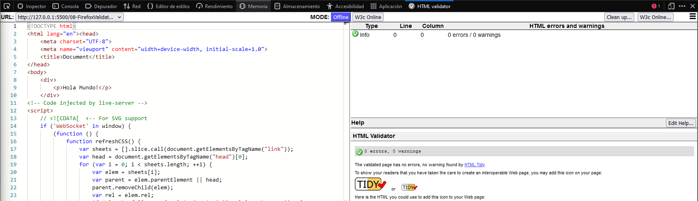
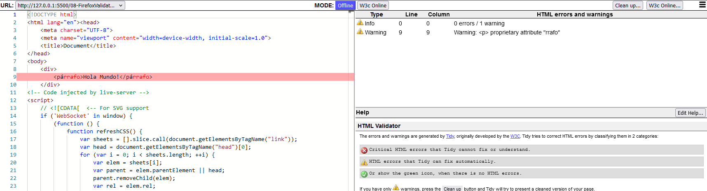
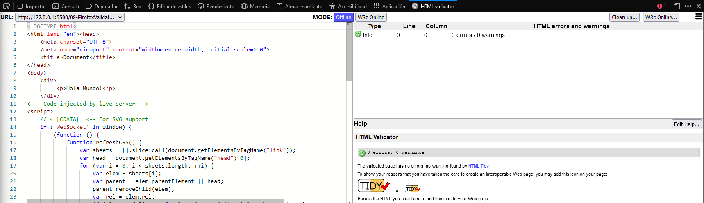
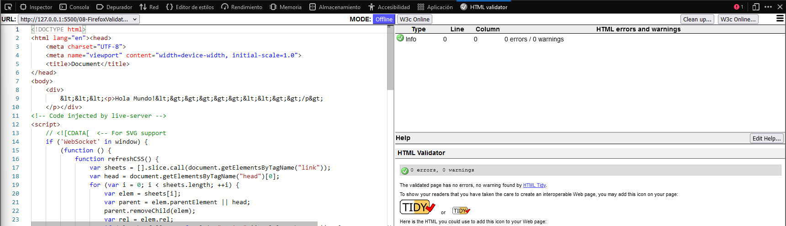
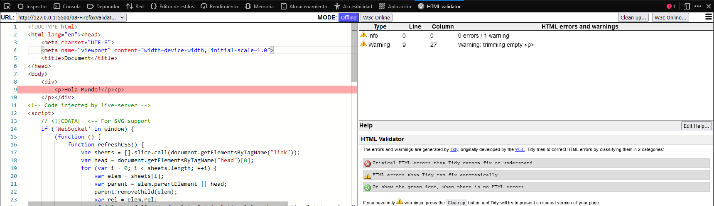
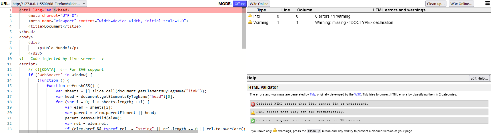
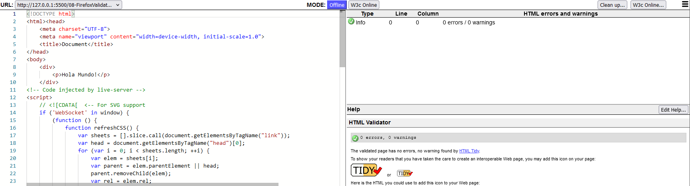
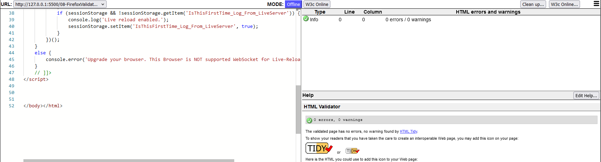

# Firefox Validator


Design by Freepik

### Autor

Hugo Moruno Parra  

Daw 2 - I.E.S Castelar

<div style="page-break-after: always;"></div>

# Índice

[Índice](#índice)  
- [Página web](#página-web)  
- [Pruebas de los errores](#pruebas-de-los-errores)  
- [Cuestiones](#cuestiones)  
- [Pruebas de los errores 2](#prueba-de-los-errores-2)
- [Pruebas de los errores 3](#prueba-de-los-errores-3)
- [Pruebas de los errores 4](#prueba-de-los-errores-4)
- [Conclusión](#conclusión)

<div style="page-break-after: always;"></div>

## Página web

Éste es el código que tendría nuestra página inicial.

```html
<!DOCTYPE html>
<html lang="en">
<head>
    <meta charset="UTF-8">
    <meta name="viewport" content="width=device-width, initial-scale=1.0">
    <title>Document</title>
</head>
<body>
    <div>
        <p>Hola Mundo!</p>
    </div>
</body>
</html>
```

Y ésta la salida del validador de Firefox.



<div style="page-break-after: always;"></div>

## Pruebas de los errores

### Quitar Etiqueta de cierre

En la línea de texto haré lo siguiente:
```html
<p>Hola Mundo!
```

Y la salida es la siguiente:


Cómo se ve, me autocompleta el p.

### Cambiar nombre de etiqueta

En la línea de texto haré lo siguiente:
```html
<párrafo>Hola Mundo!</párrafo>
```

Y la salida es la siguiente:


Cómo se ve, detecta el error y me da los avisos pertinentes.

<div style="page-break-after: always;"></div>

### Abrir unas comillas y no cerrarlas

En la línea de texto haré lo siguiente:
```html
'<p>Hola Mundo!</p>
```

Y la salida es la siguiente:


Cómo se ve, incluye la comilla simplemente como texto plano.

### Duplicar una llave 

En la línea de texto haré lo siguiente:
```html
<<<<p>Hola Mundo!<>>>>><<>>/p>
```

Y la salida es la siguiente:


Cómo se ve, incluye las llaves como texto plano.

<div style="page-break-after: always;"></div>

### Eliminar un slash

En la línea de texto haré lo siguiente:
```html
<p>Hola Mundo!<p>
```

Y la salida es la siguiente:


Cómo se ve, crea otro \<p>, que se autocierra.

<div style="page-break-after: always;"></div>

## Cuestiones

### ¿Son detectados correctamente todos los errores?

No, no detecta correctamente los errores por la forma en la que se interpreta el código ya que los intérpretes de html modernos tienen funciones de autocompletado y/o autocorrecciones.

### Si los incluimos todos, ¿es capaz el validador de detectar todos los errores al mismo tiempo incluso cuando tengamos varios que afecten a la estructura del documento?

Probablemente detecte algunos, pero no todos a la vez, porque en algunos casos, un error supone otros. Entonces, detectará los más flagrantes, pero no todos a la vez.

<div style="page-break-after: always;"></div>

## Prueba de los errores 2

### Quitar el \<!DOCTIPE html>

La salida es la siguiente:


Cómo se ve, detecta el error y da precisamente el error de que falta la etiqueta DOCTYPE.

## Prueba de los errores 3

### Quitar lang en la etiqueta html

En la línea de texto haré lo siguiente:
```html
<html lang="en"> --> <html>
```

La salida es la siguiente:


Cómo se ve, no lo detecta como un error.

<div style="page-break-after: always;"></div>

## Prueba de los errores 4

### Triplicar la etiqueta de cierre de html

En la línea de texto haré lo siguiente:
```html
</html> 
</html>
</html>
```

La salida es la siguiente:


Cómo se ve, no lo detecta como un error.

# Conclusión

Cómo se ha visto en el ejercicio se muestra como una herramienta eficaz y útil.