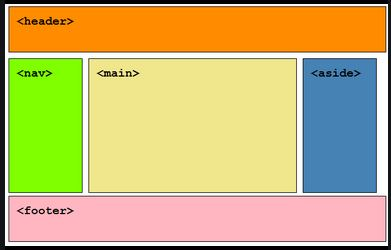
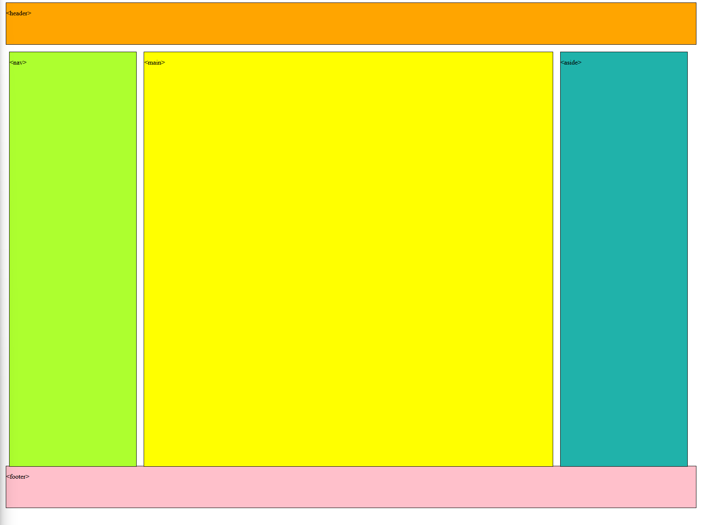

# Ej 03 HTML - CSS


Design by Freepik

### Autor

Hugo Moruno Parra  

Daw 2 - I.E.S Castelar

<div style="page-break-after: always;"></div>

# Enunciado

Realizar el diseño que tenemos en la imagen que acompaña a esta tarea.



<div style="page-break-after: always;"></div>

# Página web

Éste es el código que tendría nuestra página.

```html
<!DOCTYPE html>
<html lang="en">
<head>
    <meta charset="UTF-8">
    <meta name="viewport" content="width=device-width, initial-scale=1.0">
    <title>Document</title>
    <link rel="stylesheet" href="index.css">
</head>
<body>
    <body>
        <header><p>&#60;header&#62;<p></header>
        <div>
            <nav><p>&#60;nav&#62;<p></nav>
            <main><p>&#60;main&#62;<p></main>
            <aside><p>&#60;aside&#62;<p></aside>
        </div>
        <footer><p>&#60;footer&#62;<p></footer>
    </body>
</body>
</html>
```
<div style="page-break-after: always;"></div>

Y éste el código css.

```css
html
{
    height: 98%;
    width: 99%;
}
body
{
    height: 100%;
    width: 100%;
}
header
{
    width: 98%;
    height: 8%;
    background-color: orange;
    margin: 0.5%;
    border: 1px solid black;
}
div
{
    width: 100%;
    height: 80%;
    margin: 0.5%;
}
nav
{
    width: 18%;
    height: 100%;
    background-color: greenyellow;
    float: left;
    margin: 0.5%;
    border: 1px solid black;
}
main
{
    width: 58%;
    height: 100%;
    background-color: yellow;
    float: inline-start;
    margin: 0.5%;
    border: 1px solid black; 
}
aside
{
    width: 18%;
    height: 100%;
    background-color: lightseagreen;
    float: inline-start;
    margin: 0.5%;
    border: 1px solid black;
}
footer
{
    width: 98%;
    height: 8%;
    background-color: pink;
    margin: 0.5%;
    border: 1px solid black;
}
```
<div style="page-break-after: always;"></div>

# Preview



# Explicación

En éste ejercicio, usando los tamaños y los floats, se colocan los elementos de la forma en la que se pide en el enunciado.

# Conclusión

El elemento de css Float, es un elemento útil cuando se posicionan objetos dentro de un texto y/o grupo de imágenes. Sin embargo, cuando se trata de elementos del html, es un elemento tosco y poco intuitivo. Alternativamente, existen herramientas más eficientes y sencillas.