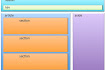
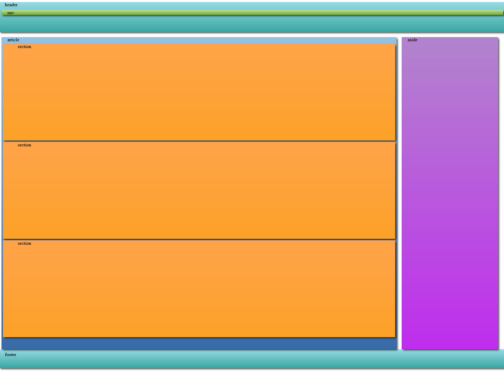

# Ej 04 HTML - CSS


Design by Freepik

### Autor

Hugo Moruno Parra  

Daw 2 - I.E.S Castelar

<div style="page-break-after: always;"></div>

# Enunciado

Realizar el diseño que tenemos en la imagen que acompaña a esta tarea.



# Página web

Éste es el código que tendría nuestra página.

```html
<!DOCTYPE html>
<html lang="en">
<head>
    <meta charset="UTF-8">
    <meta name="viewport" content="width=device-width, initial-scale=1.0">
    <title>Document</title>
    <link rel="stylesheet" href="index.css">
</head>
<body>
    <body>
        <header>
            header
            <nav>nav</nav>
        </header>
        <div>
            <article>
                article
                <section>section</section>
                <section>section</section>
                <section>section</section>
            </article>
            <aside>aside</aside>
        </div>
        <footer>footer</footer>
    </body>
</body>
</html>
```
<div style="page-break-after: always;"></div>

Y éste el código css.

```css
html {
    width: 100%;
    height: 100%;
    text-indent: 20px;
}

body {
    width: 100%;
    height: 100%;
}

header {
    width: 100%;
    height: 8%;
    background: rgb(151, 218, 226);
    background: linear-gradient(180deg, rgba(151, 218, 226, 1) 0%, rgba(56, 167, 163, 1) 100%);
    margin: 0.5%;
    box-shadow: 4px 4px 6px -1px rgba(0, 0, 0, 0.75);

}

nav {
    background: rgb(187, 226, 151);
    background: linear-gradient(180deg, rgba(187, 226, 151, 1) 0%, rgba(117, 167, 56, 1) 100%);
    margin: 0.5%;
    box-shadow: 4px 4px 6px -1px rgba(0, 0, 0, 0.75);

}

div {
    height: 83%;
    width: 100%;
    margin: 0.5%;
}

article {
    width: 78%;
    height: 100%;
    background: rgb(151, 193, 226);
    background: linear-gradient(180deg, rgba(151, 193, 226, 1) 0%, rgba(56, 106, 167, 1) 100%);
    float: inline-start;
    margin: 0.5%;
    box-shadow: 4px 4px 6px -1px rgba(0, 0, 0, 0.75);

}

section {
    height: 31%;
    background: rgb(255, 163, 73);
    background: linear-gradient(180deg, rgba(255, 163, 73, 1) 0%, rgba(252, 162, 40, 1) 100%);
    margin: 5px;
    text-indent: 50px;
    box-shadow: 4px 4px 6px -1px rgba(0, 0, 0, 0.75);

}

aside {
    height: 100%;
    width: 19%;
    background: rgb(178, 132, 205);
    background: linear-gradient(180deg, rgba(178, 132, 205, 1) 0%, rgba(191, 45, 237, 1) 100%);
    float: inline-start;
    margin: 0.5%;
    box-shadow: 4px 4px 6px -1px rgba(0, 0, 0, 0.75);

}

footer {
    height: 5%;
    width: 100%;
    background: rgb(151, 218, 226);
    background: linear-gradient(180deg, rgba(151, 218, 226, 1) 0%, rgba(56, 167, 163, 1) 100%);
    margin: 0.5%;
    box-shadow: 4px 4px 6px -1px rgba(0, 0, 0, 0.75);

}
```
<div style="page-break-after: always;"></div>

# Preview



# Explicación

En éste ejercicio, usando los tamaños y los floats, se colocan los elementos de la forma en la que se pide en el enunciado. Profundizando un poco más que en el ejercicio anterior junto con la colocación de los textos y los colores.

# Conclusión

El elemento de css Float, es un elemento útil cuando se posicionan objetos dentro de un texto y/o grupo de imágenes. Sin embargo, cuando se trata de elementos del html, es un elemento tosco y poco intuitivo. Alternativamente, existen herramientas más eficientes y sencillas.