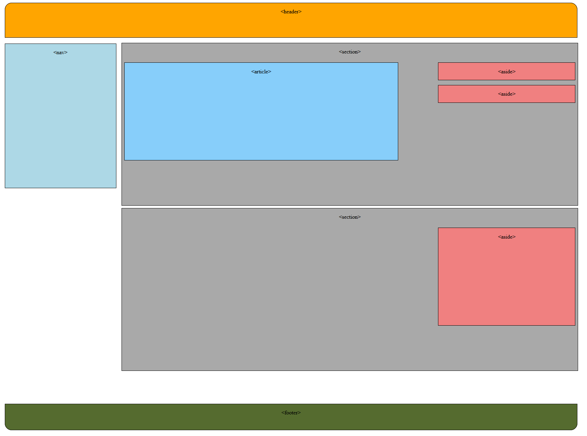

# Ej 05 HTML - CSS


Design by Freepik

### Autor

Hugo Moruno Parra  

Daw 2 - I.E.S Castelar

<div style="page-break-after: always;"></div>

# Enunciado

Realizar el diseño que tenemos en la imagen que acompaña a esta tarea.


# Página web

Éste es el código que tendría nuestra página.

```html
<!DOCTYPE html>
<html lang="en">
<head>
    <meta charset="UTF-8">
    <meta name="viewport" content="width=device-width, initial-scale=1.0">
    <title>Document</title>
    <link rel="stylesheet" href="index.css">
</head>
<body>
    <header><p>&#60;header&#62;</p></header>
    <div class="divmain">
        <nav><p>&#60;nav&#62;</p></nav>
        <div class="divbody">
            <section>
                <p>&#60;section&#62;</p>
                <article><p>&#60;article&#62;</p></article>
                <div>
                    <aside><p>&#60;aside&#62;</p></aside>
                    <aside><p>&#60;aside&#62;</p></aside>
                </div>
            </section>
            <section>
                <p>&#60;section&#62;</p>
                <aside><p>&#60;aside&#62;</p></aside>
            </section>
        </div>
    </div>
    <footer><p>&#60;footer&#62;</p></footer>
</body>
</html>
```

<div style="page-break-after: always;"></div>

Y éste el código css.

```css
html
{
    height: 98%;
    width: 99%;
}
body
{
    height: 100%;
    width: 100%;
    text-align: center;
}
header
{
    width: 98%;
    height: 8%;
    background-color: orange;
    margin: 0.5%;
    border: 1px solid black;
    border-radius: 20px 20px 0px 0px;    
}
.divmain
{
    width: 100%;
    height: 84%;
}
.divbody
{
    width: 79%;
    height: 100%;
    float: inline-start;
}
nav
{
    width: 19%;
    height: 40%;
    background-color: lightblue;
    margin: 0.5%;
    border: 1px solid black;
    float: left;
}
section
{
    height: 45%;
    background-color: darkgrey;
    margin: 0.5%;
    border: 1px solid black;
}
article
{
    width: 60%;
    height: 60%;
    background-color: lightskyblue;
    margin: 0.5%;
    border: 1px solid black;
    float: left;
}
aside
{
    width: 30%;
    height: 60%;
    background-color: lightcoral;
    margin: 0.5%;
    border: 1px solid black;
    float: right;
}
footer
{
    width: 98%;
    height: 6%;
    background-color: darkolivegreen;
    margin: 0.5%;
    border: 1px solid black;
    border-radius: 0px 0px 20px 20px;    
}
```

<div style="page-break-after: always;"></div>

# Preview



# Explicación

En éste ejercicio, usando los tamaños y los floats, se colocan los elementos de la forma en la que se pide en el enunciado.

# Conclusión

El elemento de css Float, es un elemento útil cuando se posicionan objetos dentro de un texto y/o grupo de imágenes. Sin embargo, cuando se trata de elementos del html, es un elemento tosco y poco intuitivo. Alternativamente, existen herramientas más eficientes y sencillas.