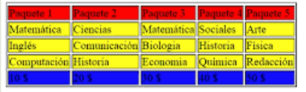
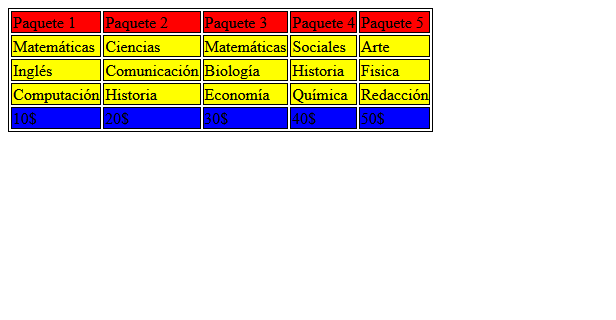

# Ej Tabla Simple 1


Design by Freepik

### Autor

Hugo Moruno Parra  

Daw 2 - I.E.S Castelar

<div style="page-break-after: always;"></div>

# Enunciado

Usando el documento Tablas HTML del apartado Material, realiza esta tabla. Simplemente crea las celdas. No es necesario aplicar colores, a no ser que te apetezca ponerlos.



# Página web

Éste es el código que tendría nuestra página.

```html
<!DOCTYPE html>
<html lang="en">
<head>
    <meta charset="UTF-8">
    <meta name="viewport" content="width=device-width, initial-scale=1.0">
    <title>Document</title>
    <link rel="stylesheet" href="index.css">
</head>
<body>
    <table>
        <thead>
            <td>
                <p>Paquete 1</p>
            </td>
            ...
        </thead>
        <tr>
            <td>
                <p>Matemáticas</p>
            </td>
            ...
        </tr>
        <tr>
            <td>
                <p>Inglés</p>
            </td>
            ...
        </tr>
        <tr>
            <td>
                <p>Computación</p>
            </td>
            ...
        </tr>
        <tfoot>
            <td>
                <p>10$</p>
            </td>
            ...
        </tfoot>
    </table>
</body>
</html>
```

<div style="page-break-after: always;"></div>

Y éste el código css.

```css
html
{
    height: 98%;
    width: 99%;
}
body
{
    height: 100%;
    width: 100%;
}
p
{
    margin: 0px;
}
table
{
    border: 1px solid black;
}
td
{
    height: fit-content;
    border: 1px solid black;
    background-color: yellow;
}
thead td 
{
    background-color: red;
}
tfoot td
{
    background-color: blue;
}
```

<div style="page-break-after: always;"></div>

# Preview



# Explicación

Se trata de una construcción básica de una tabla con cabeza y pie, útil en páginas de información clasificada.

# Conclusión

Ejercicio sencillo pero útil, entretenido.
