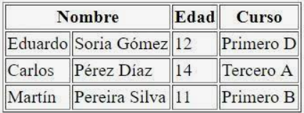
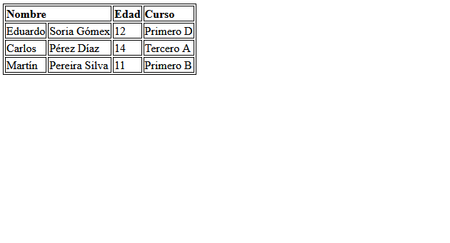

# Ej Tabla Simple 3


Design by Freepik

### Autor

Hugo Moruno Parra  

Daw 2 - I.E.S Castelar

<div style="page-break-after: always;"></div>

# Enunciado

Usando el documento Tablas HTML del apartado Material, realiza esta tabla. Simplemente crea las celdas. No es necesario aplicar colores. Utiliza los ámbitos.



# Página web

Éste es el código que tendría nuestra página.

```html
<!DOCTYPE html>
<html lang="en">
<head>
    <meta charset="UTF-8">
    <meta name="viewport" content="width=device-width, initial-scale=1.0">
    <title>Document</title>
    <link rel="stylesheet" href="index.css">
</head>
<body>
    <div>
        <table>
            <thead>
                <tr>
                    <td colspan="2">Nombre</td>
                    <td>Edad</td>
                    <td>Curso</td>
                </tr>
            </thead>
            <tbody>
                <tr>
                    <td>
                        <p>Eduardo</p>
                    </td>
                    <td>
                        <p>Soria Gómex</p>
                    </td>
                    <td>
                        <p>12</p>
                    </td>
                    <td>
                        <p>Primero D</p>
                    </td>
                </tr>
                <tr>
                    <td>
                        <p>Carlos</p>
                    </td>
                    <td>
                        <p>Pérez Díaz</p>
                    </td>
                    <td>
                        <p>14</p>
                    </td>
                    <td>
                        <p>Tercero A</p>
                    </td>
                </tr>
                <tr>
                    <td>
                        <p>Martín</p>
                    </td>
                    <td>
                        <p>Pereira Silva</p>
                    </td>
                    <td>
                        <p>11</p>
                    </td>
                    <td>
                        <p>Primero B</p>
                    </td>
                </tr>
            </tbody>
        </table>
    </div>
</body>
</html>
```

<div style="page-break-after: always;"></div>

Y éste el código css.

```css
html
{
    height: 98%;
    width: 99%;
}
body
{
    height: 100%;
    width: 100%;
}
p
{
    margin: 0px;
}
table
{
    border: 1px solid black;
}
td
{
    height: fit-content;
    border: 1px solid black;
}
thead
{
    font-weight: bold;
}
```

<div style="page-break-after: always;"></div>

# Preview



# Explicación

Se trata de una construcción básica de una tabla con cabeza y pie, útil en páginas de información clasificada.

# Conclusión

Ejercicio sencillo pero útil, entretenido.
