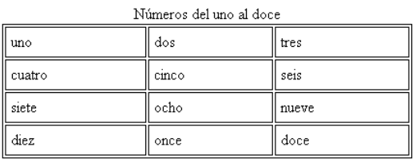
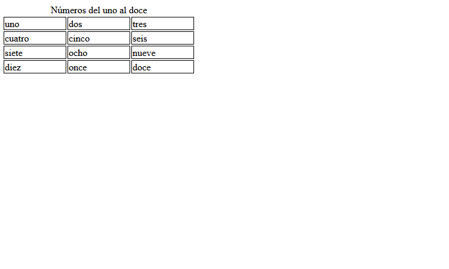

# Ej Tabla Simple 6


Design by Freepik

### Autor

Hugo Moruno Parra  

Daw 2 - I.E.S Castelar

<div style="page-break-after: always;"></div>

# Enunciado

Usando el documento Tablas HTML del apartado Material, realiza esta tabla. Simplemente crea las celdas. No es necesario aplicar colores.



# Página web

Éste es el código que tendría nuestra página.

```html
<!DOCTYPE html>
<html lang="en">
<head>
    <meta charset="UTF-8">
    <meta name="viewport" content="width=device-width, initial-scale=1.0">
    <title>Document</title>
    <link rel="stylesheet" href="index.css">
</head>
<body>
    <div>
        <table>
            <thead>
                <tr>
                    <td colspan="3">
                        <p>Números del uno al doce</p>
                    </td>
                </tr>
            </thead>
            <tbody>
                <tr>
                    <td>
                        <p>uno</p>
                    </td>
                    <td>
                        <p>dos</p>
                    </td>
                    <td>
                        <p>tres</p>
                    </td>
                </tr>
                <tr>
                    <td>
                        <p>cuatro</p>
                    </td>
                    <td>
                        <p>cinco</p>
                    </td>
                    <td>
                        <p>seis</p>
                    </td>
                </tr>
                <tr>
                    <td>
                        <p>siete</p>
                    </td>
                    <td>
                        <p>ocho</p>
                    </td>
                    <td>
                        <p>nueve</p>
                    </td>
                </tr>
                <tr>
                    <td>
                        <p>diez</p>
                    </td>
                    <td>
                        <p>once</p>
                    </td>
                    <td>
                        <p>doce</p>
                    </td>
                </tr>
            </tbody>
        </table>
    </div>
</body>
</html>
```

<div style="page-break-after: always;"></div>

Y éste el código css.

```css
html
{
    height: 98%;
    width: 99%;
}
body
{
    height: 100%;
    width: 100%;
}
p
{
    margin: 0px;
}

td
{
    height: fit-content;
    border: 1px solid black;
    width: 100px;
}
tbody
{
    border: 1px solid black;
}
thead td
{
    border: none;
    text-align: center;
}
```

<div style="page-break-after: always;"></div>

# Preview



# Explicación

Se trata de una construcción básica de una tabla con cabecero, útil en páginas de información clasificada.

# Conclusión

Ejercicio sencillo pero útil, entretenido.
