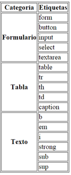
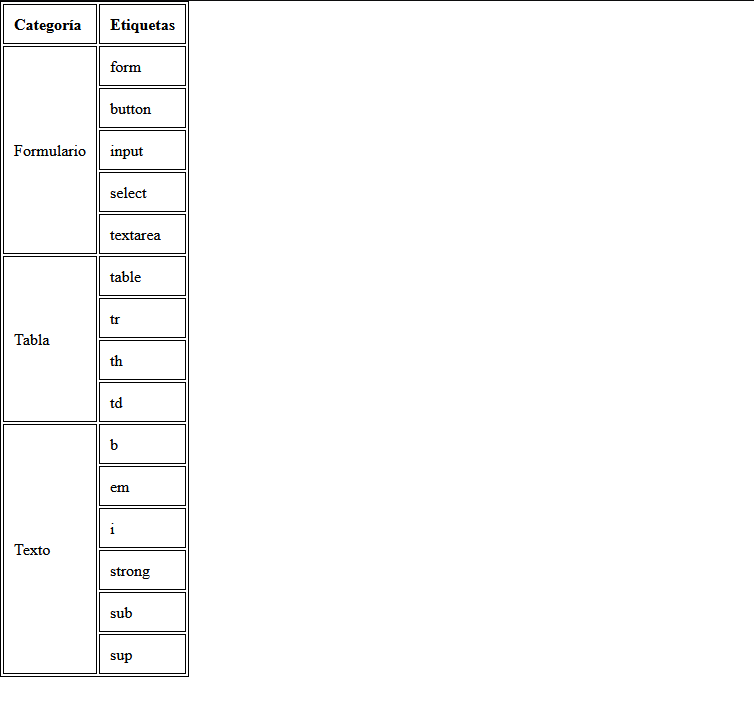

# Ej Tabla Simple 7


Design by Freepik

### Autor

Hugo Moruno Parra  

Daw 2 - I.E.S Castelar

<div style="page-break-after: always;"></div>

# Enunciado

Usando el documento Tablas HTML del apartado Material, realiza esta tabla.

Identifica cada una de las partes que debes realizar.  
Si está en negrita el encabezado, debes definirlo como tal.  
Si está en negrita el pie, debes definirlo como tal.  
Realiza los ámbitos (scope).  



# Página web

Éste es el código que tendría nuestra página.

```html
<!DOCTYPE html>
<html lang="en">
<head>
    <meta charset="UTF-8">
    <meta name="viewport" content="width=device-width, initial-scale=1.0">
    <title>Document</title>
    <link rel="stylesheet" href="index.css">
</head>
<body>
    <table>
        <thead>
            <th>Categoría</th>
            <th>Etiquetas</th>
        </thead>
        <tbody>
            <tr>
                <td rowspan="5">Formulario</td>
                <td>form</td>
            </tr>
            <tr>
                <td>button</td>
            </tr>
            <tr>
                <td>input</td>
            </tr>
            <tr>
                <td>select</td>
            </tr>
            <tr>
                <td>textarea</td>
            </tr>
            <tr>
                <td rowspan="4">Tabla</td>
                <td>table</td>
            </tr>
            <tr>
                <td>tr</td>
            </tr>
            <tr>
                <td>th</td>
            </tr>
            <tr>
                <td>td</td>
            </tr>
            <tr>
                <td rowspan="6">Texto</td>
                <td>b</td>
            </tr>
            <tr>
                <td>em</td>
            </tr>
            <tr>
                <td>i</td>
            </tr>
            <tr>
                <td>strong</td>
            </tr>
            <tr>
                <td>sub</td>
            </tr>
            <tr>
                <td>sup</td>
            </tr>
        </tbody>
    </table>
</body>
</html>
```

<div style="page-break-after: always;"></div>

Y éste el código css.

```css
html, body
{
    width: 100%;
    height: 100%;
    margin: 0;
    padding: 0;
}
table
{
    border: 1px solid #000;
}
th, td {
    border: 1px solid #000;
    padding: 10px;
    text-align: left;
}
```

<div style="page-break-after: always;"></div>

# Preview



# Explicación

Se trata de una construcción básica de una tabla con uniones entre columnas y filas, útil en páginas de información clasificada.

# Conclusión

Ejercicio sencillo pero útil, entretenido.
