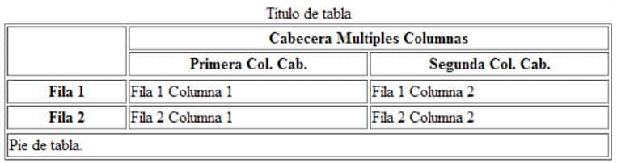
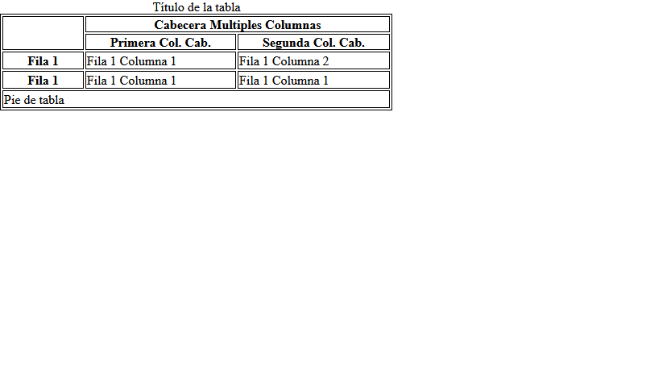

# Ej Tabla Simple 9


Design by Freepik

### Autor

Hugo Moruno Parra  

Daw 2 - I.E.S Castelar

<div style="page-break-after: always;"></div>

# Enunciado

Usando el documento Tablas HTML del apartado Material, realiza esta tabla.

En este caso puedes aplicar todo el contenido del documento Tablas HTML. Puedes aplicar colores.



# Página web

Éste es el código que tendría nuestra página.

```html
<!DOCTYPE html>
<html lang="en">
<head>
    <meta charset="UTF-8">
    <meta name="viewport" content="width=device-width, initial-scale=1.0">
    <title>Document</title>
    <link rel="stylesheet" href="./index.css">
</head>
<body>
    <div>
        <p>Título de la tabla</p>
        <table>
            <thead>
                <tr>
                    <th rowspan="2"></th>
                    <th colspan="4">Cabecera Multiples Columnas</th>
                </tr>
                <tr>
                    <th colspan="2">Primera Col. Cab.</th>
                    <th colspan="2">Segunda Col. Cab.</th>
                </tr>
            </thead>
            <tbody>
                <tr>
                    <th>Fila 1</th>
                    <td colspan="2">Fila 1 Columna 1</td>
                    <td colspan="2">Fila 1 Columna 2</td>
                </tr>
                <tr>
                    <th>Fila 1</th>
                    <td colspan="2">Fila 1 Columna 1</td>
                    <td colspan="2">Fila 1 Columna 1</td>
                </tr>
            </tbody>
            <tfoot>
                <tr>
                    <td colspan="5">Pie de tabla</td>
                </tr>
            </tfoot>
        </table>
    </div>
</body>
</html>
```

<div style="page-break-after: always;"></div>

Y éste el código css.

```css
html, body
{
    width: 100%;
    height: 100%;
    margin: 0;
    padding: 0;
}
table, thead, tbody, td, th
{
    border: 1px solid #000;
}
th
{
    padding: 0 30px;
}
div
{
    width: 488px;
}
p
{
    text-align: center;
    margin: 0;
}
```

<div style="page-break-after: always;"></div>

# Preview



# Explicación

Se trata de una construcción básica de una tabla con uniones entre columnas y filas, útil en páginas de información clasificada.

# Conclusión

Ejercicio sencillo pero útil, entretenido.
