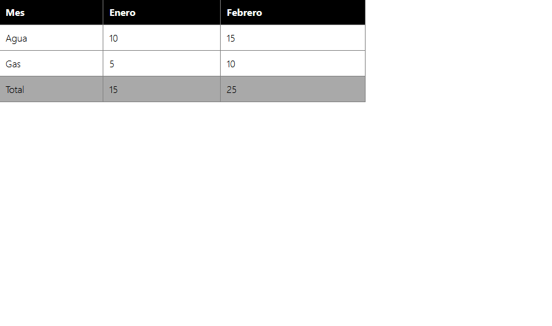

# Ej Tabla Simple 10


Design by Freepik

### Autor

Hugo Moruno Parra  

Daw 2 - I.E.S Castelar

<div style="page-break-after: always;"></div>

# Enunciado

Realiza las siguientes tablas.


<div style="page-break-after: always;"></div>

# Página web 1

Éste es el código que tendría nuestra página.

```html
<!DOCTYPE html>
<html lang="en">
<head>
    <meta charset="UTF-8">
    <meta name="viewport" content="width=device-width, initial-scale=1.0">
    <title>Document</title>
    <link rel="stylesheet" href="index1.css">
</head>
<body>
    <table>
        <thead>
            <th>Mes</th>
            <th>Enero</th>
            <th>Febrero</th>
        </thead>
        <tbody>
            <tr>
                <td>Agua</td>
                <td>10</td>
                <td>15</td>
            </tr>
            <tr>
                <td>Gas</td>
                <td>5</td>
                <td>10</td>
            </tr>
        </tbody>
        <tfoot>
            <tr>
                <td>Total</td>
                <td>15</td>
                <td>25</td>
            </tr>
        </tfoot>
    </table>
</body>
</html>
```

<div style="page-break-after: always;"></div>

Y éste el código css.

```css
html, body
{
    width: 100%;
    height: 100%;
    margin: 0;
    padding: 0;
    font-family: 'Segoe UI', Tahoma, Geneva, Verdana, sans-serif;
    font-weight: lighter;
}
table
{
    width: 600px;
    border-collapse: collapse;
    border: 1px solid grey;
}
thead
{
    background-color: black;
    color: white;
}
tfoot
{
    background-color: darkgrey;
}
th
{
    text-align: left;
}
th, td
{
    padding: 10px;
    border: 1px solid grey;
}
```

<div style="page-break-after: always;"></div>

# Página web 2

Éste es el código que tendría nuestra página.

```html
<!DOCTYPE html>
<html lang="en">
<head>
    <meta charset="UTF-8">
    <meta name="viewport" content="width=device-width, initial-scale=1.0">
    <title>Document</title>
    <link rel="stylesheet" href="index2.css">
</head>
<body>
    <table>
        <tr>
            <td colspan="2" id="tabla1">Enero</td>
            <td colspan="2" id="tabla2">Febrero</td>
        </tr>
        <tr>
            <td id="tabla1">Ingresos</td>
            <td id="tabla1">Gastos</td>
            <td id="tabla2">Ingresos</td>
            <td id="tabla2">Gastos</td>
        </tr>
        <tr>
            <td id="tabla1">1.000€</td>
            <td id="tabla1">700€</td>
            <td id="tabla2">1.100€</td>
            <td id="tabla2">580€</td>
        </tr>
        <tr>
            <td id="tabla1">1.000€</td>
            <td id="tabla1">920€</td>
            <td id="tabla2">1.750€</td>
            <td id="tabla2">920€</td>
        </tr>
    </table>
</body>
</html>
```

<div style="page-break-after: always;"></div>

Y éste el código css.

```css
html, body
{
    width: 100%;
    height: 100%;
    margin: 0;
    padding: 0;
    font-family: 'Segoe UI', Tahoma, Geneva, Verdana, sans-serif;
    font-weight: lighter;
}
table
{
    width: 800px;
    border-collapse: collapse;
    margin: 10px;
    color: darkslategray;
}
th
{
    text-align: left;
}
th, td
{
    width: 200px;
    padding: 10px;
    border: 1px solid white;
}
#tabla1
{
    background-color: rgb(255, 199, 172);
}
#tabla2
{
    background-color: lightsalmon;
}
```

<div style="page-break-after: always;"></div>

# Preview




<div style="page-break-after: always;"></div>

# Explicación

Se trata de una construcción básica de una tabla con uniones entre columnas y filas, útil en páginas de información clasificada.
Además de la aplicación de estilos a las mismas.

# Conclusión

Ejercicio sencillo pero útil, entretenido.
