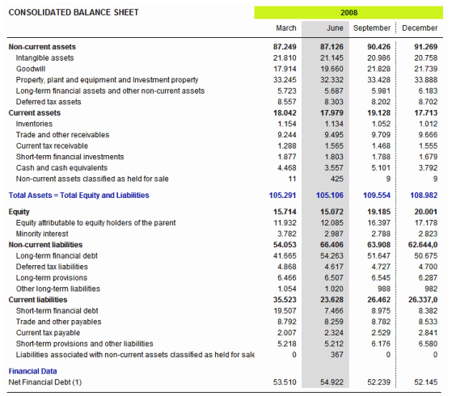
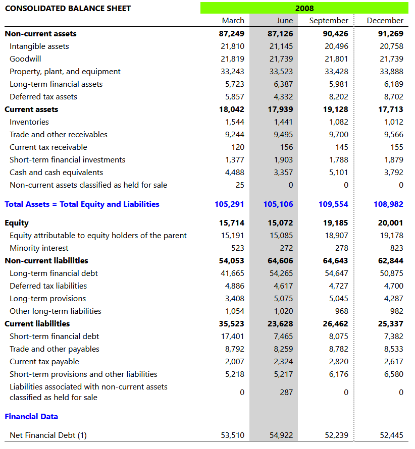

# Ej Tabla 11


Design by Freepik

### Autor

Hugo Moruno Parra  

Daw 2 - I.E.S Castelar

<div style="page-break-after: always;"></div>

# Enunciado

Realiza la siguiente tabla. No te preocupes del diseño, sólo de las celdas, agrupación y secciones (thead, etc).



# Página web

Éste es el código que tendría nuestra página.

```html
<!DOCTYPE html>
<html lang="en">
<head>
    <meta charset="UTF-8">
    <meta name="viewport" content="width=device-width, initial-scale=1.0">
    <title>Tabla 11</title>
    <link rel="stylesheet" href="index.css">
</head>
<body>
    <table>
        <thead>
            <tr>
                <th id="title">CONSOLIDATED BALANCE SHEET</th>
                <th id="year" colspan="4">2008</th>
            </tr>
            <tr id="years">
                <td id="texto"></td>
                <td>March</td>
                <td>June</td>
                <td>September</td>
                <td>December</td>
            </tr>
        </thead>
        <tbody>
            <tr id="dataBlockHeader">
                <td id="texto">Non-current assets</td>
                <td>87,249</td>
                <td>87,126</td>
                <td>90,426</td>
                <td>91,269</td>
            </tr>
            <tr>
                <td id="texto">Intangible assets</td>
                <td>21,810</td>
                <td>21,145</td>
                <td>20,496</td>
                <td>20,758</td>
            </tr>
            <tr>
                <td id="texto">Goodwill</td>
                <td>21,819</td>
                <td>21,739</td>
                <td>21,801</td>
                <td>21,739</td>
            </tr>
            <tr>
                <td id="texto">Property, plant, and equipment</td>
                <td>33,243</td>
                <td>33,523</td>
                <td>33,428</td>
                <td>33,888</td>
            </tr>
            <tr>
                <td id="texto">Long-term financial assets</td>
                <td>5,723</td>
                <td>6,387</td>
                <td>5,981</td>
                <td>6,189</td>
            </tr>
            <tr>
                <td id="texto">Deferred tax assets</td>
                <td>5,857</td>
                <td>4,332</td>
                <td>8,202</td>
                <td>8,702</td>
            </tr>
            <tr id="dataBlockHeader">
                <td id="texto">Current assets</td>
                <td>18,042</td>
                <td>17,939</td>
                <td>19,128</td>
                <td>17,713</td>
            </tr>
            <tr>
                <td id="texto">Inventories</td>
                <td>1,544</td>
                <td>1,441</td>
                <td>1,082</td>
                <td>1,012</td>
            </tr>
            <tr>
                <td id="texto">Trade and other receivables</td>
                <td>9,244</td>
                <td>9,495</td>
                <td>9,700</td>
                <td>9,566</td>
            </tr>
            <tr>
                <td id="texto">Current tax receivable</td>
                <td>120</td>
                <td>156</td>
                <td>145</td>
                <td>155</td>
            </tr>
            <tr>
                <td id="texto">Short-term financial investments</td>
                <td>1,377</td>
                <td>1,903</td>
                <td>1,788</td>
                <td>1,879</td>
            </tr>
            <tr>
                <td id="texto">Cash and cash equivalents</td>
                <td>4,488</td>
                <td>3,357</td>
                <td>5,101</td>
                <td>3,792</td>
            </tr>
            <tr>
                <td id="texto">Non-current assets classified as held for sale</td>
                <td>25</td>
                <td>0</td>
                <td>0</td>
                <td>0</td>
            </tr>
            <tr id="dataBlockFooter">
                <td id="texto">Total Assets = Total Equity and Liabilities</td>
                <td>105,291</td>
                <td>105,106</td>
                <td>109,554</td>
                <td>108,982</td>
            </tr>
            <tr id="dataBlockHeader">
                <td id="texto">Equity</td>
                <td>15,714</td>
                <td>15,072</td>
                <td>19,185</td>
                <td>20,001</td>
            </tr>
            <tr>
                <td id="texto">Equity attributable to equity holders of the parent</td>
                <td>15,191</td>
                <td>15,085</td>
                <td>18,907</td>
                <td>19,178</td>
            </tr>
            <tr>
                <td id="texto">Minority interest</td>
                <td>523</td>
                <td>272</td>
                <td>278</td>
                <td>823</td>
            </tr>
            <tr id="dataBlockHeader">
                <td id="texto">Non-current liabilities</td>
                <td>54,053</td>
                <td>64,606</td>
                <td>64,643</td>
                <td>62,844</td>
            </tr>
            <tr>
                <td id="texto">Long-term financial debt</td>
                <td>41,665</td>
                <td>54,265</td>
                <td>54,647</td>
                <td>50,875</td>
            </tr>
            <tr>
                <td id="texto">Deferred tax liabilities</td>
                <td>4,886</td>
                <td>4,617</td>
                <td>4,727</td>
                <td>4,700</td>
            </tr>
            <tr>
                <td id="texto">Long-term provisions</td>
                <td>3,408</td>
                <td>5,075</td>
                <td>5,045</td>
                <td>4,287</td>
            </tr>
            <tr>
                <td id="texto">Other long-term liabilities</td>
                <td>1,054</td>
                <td>1,020</td>
                <td>968</td>
                <td>982</td>
            </tr>
            <tr id="dataBlockHeader">
                <td id="texto">Current liabilities</td>
                <td>35,523</td>
                <td>23,628</td>
                <td>26,462</td>
                <td>25,337</td>
            </tr>
            <tr>
                <td id="texto">Short-term financial debt</td>
                <td>17,401</td>
                <td>7,465</td>
                <td>8,075</td>
                <td>7,382</td>
            </tr>
            <tr>
                <td id="texto">Trade and other payables</td>
                <td>8,792</td>
                <td>8,259</td>
                <td>8,782</td>
                <td>8,533</td>
            </tr>
            <tr>
                <td id="texto">Current tax payable</td>
                <td>2,007</td>
                <td>2,324</td>
                <td>2,820</td>
                <td>2,617</td>
            </tr>
            <tr>
                <td id="texto">Short-term provisions and other liabilities</td>
                <td>5,218</td>
                <td>5,217</td>
                <td>6,176</td>
                <td>6,580</td>
            </tr>
            <tr>
                <td id="texto">Liabilities associated with non-current assets classified as held for sale</td>
                <td>0</td>
                <td>287</td>
                <td>0</td>
                <td>0</td>
            </tr>
            <tr id="dataBlockFooter">
                <td id="texto">Financial Data</td>
                <td></td>
                <td></td>
                <td></td>
                <td></td>
            </tr>
            <tr id="dataFinalBlock">
                <td id="texto">Net Financial Debt (1)</td>
                <td>53,510</td>
                <td>54,922</td>
                <td>52,239</td>
                <td>52,445</td>
            </tr>
        </tbody>
    </table>
</body>
</html>

```

<div style="page-break-after: always;"></div>

Y éste el código css.

```css
html, body
{
    width: 100%;
    height: 100%;
    margin: 0;
    padding: 0;
    font-family: 'Segoe UI', Tahoma, Geneva, Verdana, sans-serif;
}
#year
{
    background-color: chartreuse;
}
table
{
    border-bottom: 1px solid black;
    border-collapse: collapse;
    width: 800px;
    margin: 10px;
}
thead
{
    border-bottom: 1px solid black;
}
thead #title
{
    text-align: left;
}
table td
{
    width: 100px;
    text-align: right;
    padding: 2px 10px;
}
table #texto
{
    width: 600px;
    padding-left: 10px;
    text-align: left;
}
table #dataBlockHeader
{
    font-weight: bold;
}
table #dataBlockHeader > td
{
    padding-left: 0;
}
table #dataBlockFooter
{
    font-weight: bold;
    color: blue !important;
    height: 50px;
}
table #dataBlockFooter > td
{
    padding-left: 0;
}
table td:nth-child(4)
{
    padding-right: 10px;
    border-right: 2px dotted grey;
}
table td:nth-child(3)
{
    background-color: lightgrey;
}
```

<div style="page-break-after: always;"></div>

# Preview



# Explicación

Se trata de una construcción de una tabla con uniones entre columnas y filas, útil en páginas de información clasificada.
Además de la aplicación de estilos a las mismas.

# Conclusión

Ejercicio realista pero entretenido, además de útil, ya que trabaja un formato muy común entre los documentos informativos de las empresas.