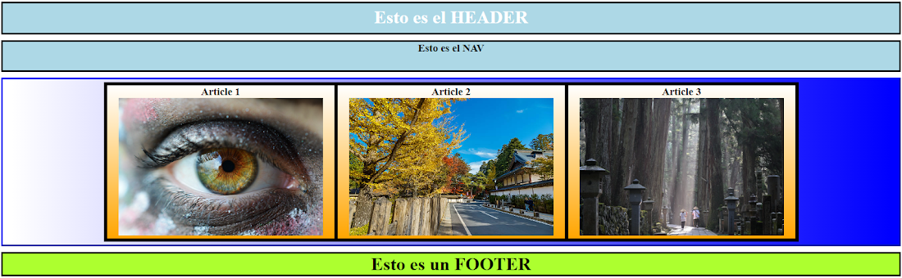
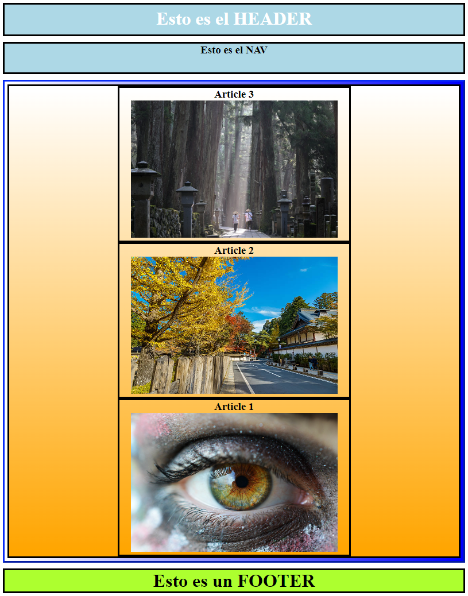
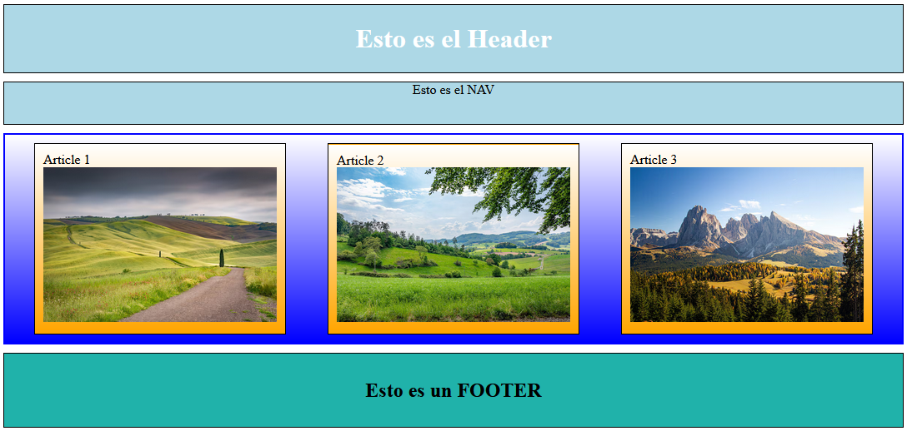
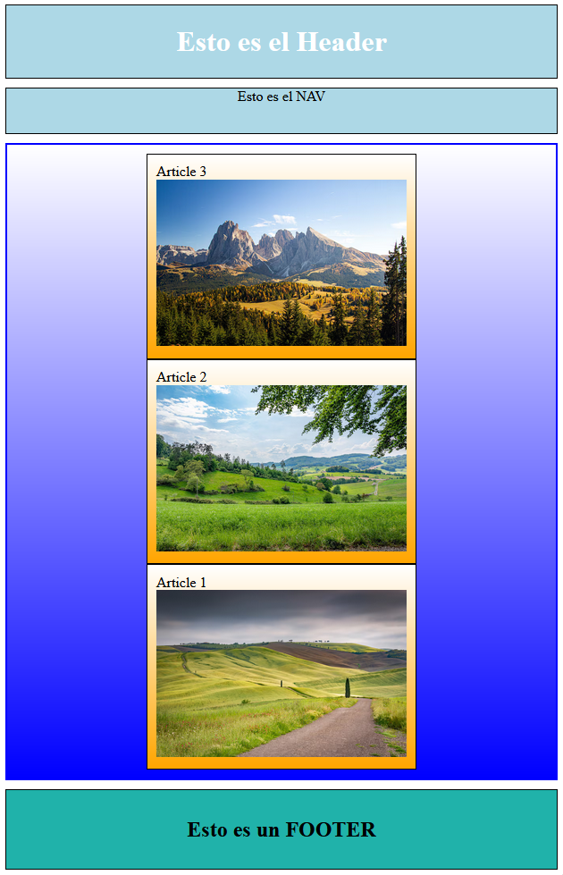

# Ej Flexbox 1
 

Design by Freepik

### Autor

Hugo Moruno Parra  

Daw 2 - I.E.S Castelar

<div style="page-break-after: always;"></div>

# Enunciado

Vamos a realizar un ejercicio básico de Flexbox en el que 3 imágenes, dentro de una <article> al hacer más pequeña la web, se reordenen de forma inversa, es decir, partimos de la imagen 1 y al reducir su tamaño, obtendremos la imagen 2.
Para ello utilizaremos display: flex;
Utiliza el documento "FLEXBOX y CSS GRID" del apartado "MATERIAL".




# Página web

Éste es el código que tendría nuestra página.

```html
<!DOCTYPE html>
<html lang="en">
<head>
    <meta charset="UTF-8">
    <meta name="viewport" content="width=device-width, initial-scale=1.0">
    <title>Document</title>
    <link rel="stylesheet" href="index.css">
</head>
<body>
    <header>
        <h1>Esto es el Header</h1>
    </header>
    <nav>
        <p>Esto es el NAV</p>
    </nav>
    <section>
        <article>
            <p>Article 1</p>
            
        </article>
        <article>
            <p>Article 2</p>
            
        </article>
        <article>
            <p>Article 3</p>
            
        </article>
    </section>
    <footer>
        <h2>Esto es un FOOTER</h2>
    </footer>
</body>
</html>
```

<div style="page-break-after: always;"></div>

Y éste el código css.

```css
html, body 
{
    width: 100%;
    height: 100%;
    margin: 0;
    height: 0;
}
header
{
    background-color: lightblue;
    color: white;
    display: flex;
    align-items: center;
    justify-content: center;
    border: 1px solid #000;
    margin: 10px;
}
nav
{
    height: 50px;
    background-color: lightblue;
    display: flex;
    justify-content: center;
    border: 1px solid #000;
    margin: 10px;
}
section
{
    display: flex;
    flex-direction: row;
    align-items: center;
    justify-content: space-around;
    flex-wrap: wrap-reverse;
    border: 2px solid #00F;
    background: linear-gradient(#FFF, #00F);
    padding: 10px;
    margin: 10px;
}
article
{
    background: linear-gradient(#FFF, orange);
    padding: 10px;
    border: 1px solid #000;
}
p
{
    margin: 0;
}
img
{
    width: 280px;
}
footer
{
    display: flex;
    align-items: center;
    justify-content: center;
    background-color: lightseagreen;
    border: 1px solid #000;
    padding: 10px;
    margin: 10px;
}
```

<div style="page-break-after: always;"></div>

# Preview




# Explicación

Página que según su ancho se adapta para mostrar su contenido de forma agradable.

# Conclusión

Construcción sencilla y útil para la colocación de elementos de manera responsiva.
