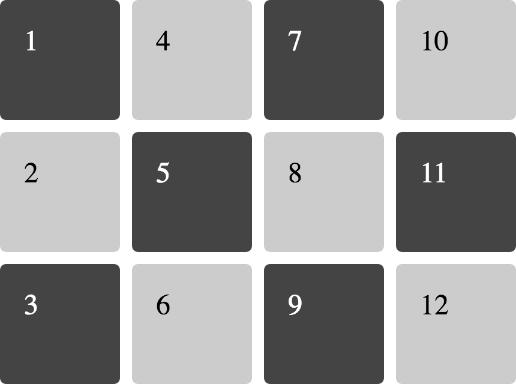
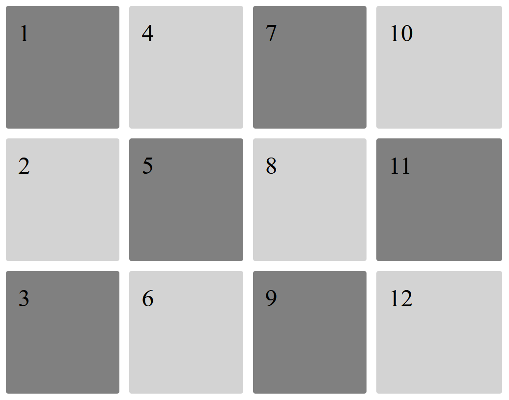

# Ej Grid 1


Design by Freepik

### Autor

Hugo Moruno Parra  

Daw 2 - I.E.S Castelar

<div style="page-break-after: always;"></div>

# Enunciado

Crea el siguiente diseño con Grid de CSS.



# Página web

Éste es el código que tendría nuestra página.

```html
<!DOCTYPE html>
<html lang="en">
<head>
    <meta charset="UTF-8">
    <meta name="viewport" content="width=device-width, initial-scale=1.0">
    <title>Document</title>
    <link rel="stylesheet" href="index.css">
</head>
<body>
    <main>
        <div><p>1<p></div>
        <div><p>2<p></div>
        <div><p>3<p></div>
        <div><p>4<p></div>
        <div><p>5<p></div>
        <div><p>6<p></div>
        <div><p>7<p></div>
        <div><p>8<p></div>
        <div><p>9<p></div>
        <div><p>10<p></div>
        <div><p>11<p></div>
        <div><p>12<p></div>
    </main>
</body>
</html>
```

<div style="page-break-after: always;"></div>

Y éste el código css.

```css
html
{
    height: 98%;
    width: 99%;
}
body
{
    height: 100%;
    width: 100%;
}
p
{
    margin: 0px;
    width: fit-content;
}
main
{
    max-width: 1030px;
    display: grid;
    grid-auto-flow: column;
    grid-template-rows: auto auto auto;
    grid-template-columns: auto auto auto auto;
    grid-area: auto;
}
div
{
    margin: 10px;
    background-color: grey;
    min-height: 200px;
    border-radius: 5px;
    font-size: 50px;
    padding: 25px;
}
div:nth-child(even)
{
    background-color: lightgrey;
}
```

<div style="page-break-after: always;"></div>

# Preview



# Explicación

Página que distribuye su contenido de forma ordenada en base a el elemento grid.

# Conclusión

Muy útil en la muestra de elementos visuales o elementos de organización de contenido.