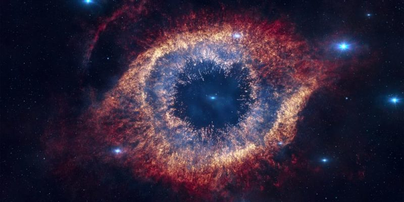
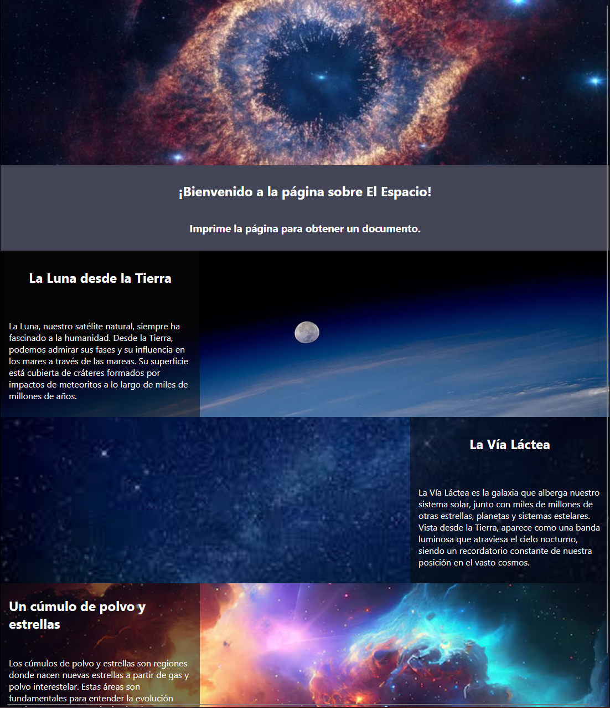
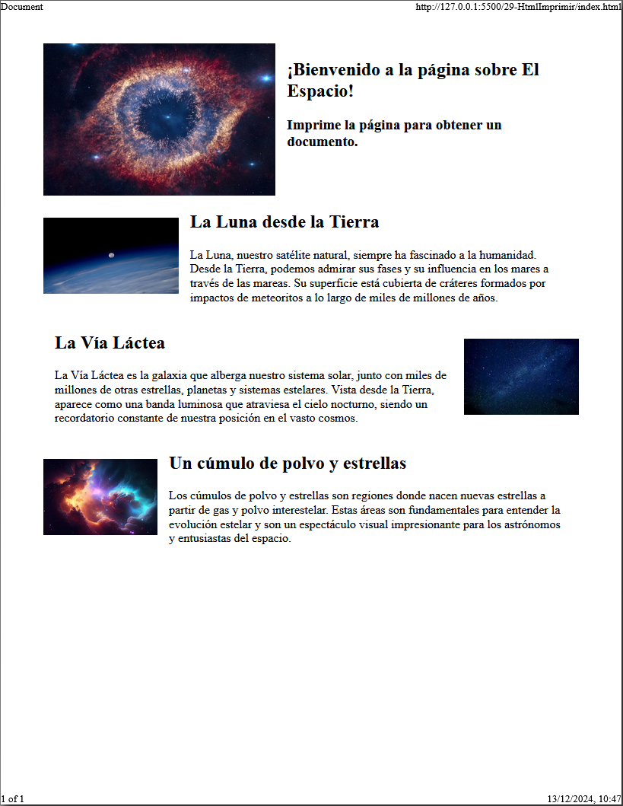

# Ej Página para imprimir


Design by Freepik

### Autor

Hugo Moruno Parra  

Daw 2 - I.E.S Castelar

<div style="page-break-after: always;"></div>

# Enunciado

Debes realizar un diseño para pantalla y otro diseño para impresión en el que cambien totalmente los elementos de sitio.
Para ello, utiliza el siguiente enlace para utilizar correctamente las etiquetas @media screen y @media print.
La idea es realizar una página sencilla que debe visualizarse correctamente en pantalla y posteriormente, cuando le demos a imprimir, se reajuste de forma diferente, quedando un formato "amigable" para un papel.

# Página web

Éste es el código que tendría nuestra página.

```html
<!DOCTYPE html>
<html lang="en">
<head>
  <meta charset="UTF-8">
  <meta name="viewport" content="width=device-width, initial-scale=1.0">
  <title>Document</title>
  <link rel="stylesheet" href="index.css">
</head>
<body>
  <nav>
    
    <div>
      <h1>¡Bienvenido a la página sobre El Espacio!</h1>
      <h3>Imprime la página para obtener un documento.</h3>
    </div>
  </nav>
  <main>
    <section>
      
      <div>
        <h1>La Luna desde la Tierra</h1>
        <p>La Luna, nuestro satélite natural, siempre ha fascinado a la humanidad. Desde la Tierra, podemos admirar sus fases y su influencia en los mares a través de las mareas. Su superficie está cubierta de cráteres formados por impactos de meteoritos a lo largo de miles de millones de años.</p>
      </div>
    </section>
    <section>
      <div>
        <h1>La Vía Láctea</h1>
        <p>La Vía Láctea es la galaxia que alberga nuestro sistema solar, junto con miles de millones de otras estrellas, planetas y sistemas estelares. Vista desde la Tierra, aparece como una banda luminosa que atraviesa el cielo nocturno, siendo un recordatorio constante de nuestra posición en el vasto cosmos.</p>
      </div>
      
    </section>
    <section>
      
      <div>
        <h1>Un cúmulo de polvo y estrellas</h1>
        <p>Los cúmulos de polvo y estrellas son regiones donde nacen nuevas estrellas a partir de gas y polvo interestelar. Estas áreas son fundamentales para entender la evolución estelar y son un espectáculo visual impresionante para los astrónomos y entusiastas del espacio.</p>
      </div>
    </section>    
  </main>
</body>
</html>
```

<div style="page-break-after: always;"></div>

Y éste el código css.

```css
@media screen {

  html, body
  {
    width: 100%;
    height: 100%;
    margin: 0;
    display: flex;
    flex-direction: column;
    font-family: 'Segoe UI', Tahoma, Geneva, Verdana, sans-serif;
  }
  
  nav
  {
    width: 100%;
    height: fit-content;
    display: flex;
    flex-direction: column;
    justify-content: center;
    align-items: center;
  }

  nav > img
  {
    width: 100%;
    height: 300px;
    object-fit: cover;
  }

  nav > div
  {
    width: 100%;
    color: white;
    background-color: rgb(67, 69, 87);
    display: flex;
    flex-direction: column;
    justify-content: center;
    align-items: center;
    padding: 10px;
  }

  section
  {
    height: 300px;
    width: 100%;
    position: relative;
  }

  section img
  {
    position: absolute;
    top: 0;
    left: 0;
    height: 300px;
    width: 100%; 
    object-fit: cover;
    z-index: 1;
  }

  section > div
  {
    position: absolute;
    width: 30%;
    height: 300px;
    padding: 0 15px;
    z-index: 2;
    color: white;
    background-color: rgba(7, 7, 7, 0.521);
    display: flex;
    align-items: center;
    flex-direction: column;
    justify-content: space-around;
  }

  section > div:nth-child(odd)
  {
    top: 0;
    right: 0;
  }

}

@media print {
  
  nav
  {
    width: 100%;
    display: flex;
    flex-direction: row;
  }
  
  nav > img
  {
    width: 50%;
    height: 200px;
    object-fit: cover;
  }

  nav > div
  {
    padding: 0 15px;
  }

  main
  {
    display: flex;
    flex-direction: column;
  }

  section
  {
    display: flex;
    flex-direction: row;
    justify-content: space-around;
    align-items: center;
  }

  section > img
  {
    height: 100px;
    width: 200px;
    object-fit: cover;
  }
  
  section > div 
  {
    padding: 0 15px;
  }

}
```

# Preview
<div style="page-break-after: always;"></div>



<div style="page-break-after: always;"></div>



<div style="page-break-after: always;"></div>

# Explicación

Usando las propiedades @media screen y @media print, se consigue estructurar la misma página de distinta manera y rehacer el diseño para la impresión de la misma.

# Conclusión

Un ejercicio interesante ya que explora un área poco conocida y muy útil.