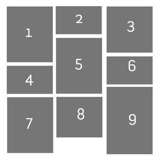
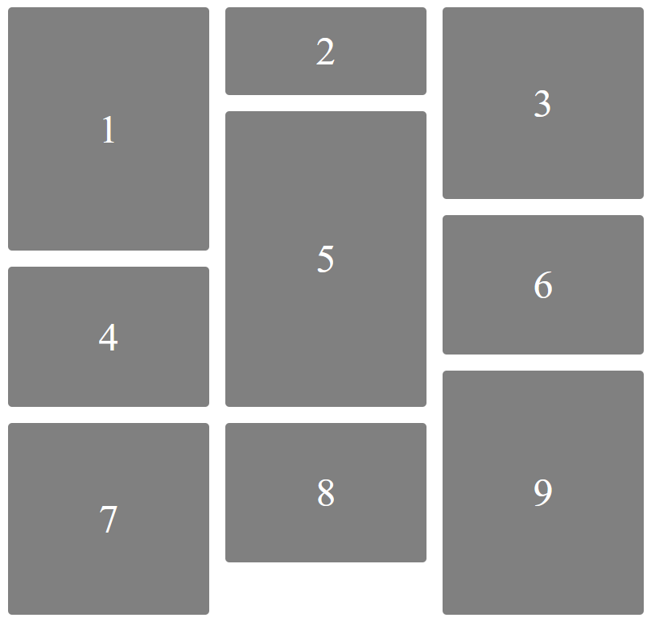

# Ej Grid 2


Design by Freepik

### Autor

Hugo Moruno Parra  

Daw 2 - I.E.S Castelar

<div style="page-break-after: always;"></div>

# Enunciado

Crea el siguiente diseño con Grid de CSS.

Se incluye un fichero de ayuda. Ten en cuenta que quizás la altura de las filas es igual y puede variar algo el dibujo.



# Página web

Éste es el código que tendría nuestra página.

```html
<!DOCTYPE html>
<html lang="en">
<head>
    <meta charset="UTF-8">
    <meta name="viewport" content="width=device-width, initial-scale=1.0">
    <title>Document</title>
    <link rel="stylesheet" href="index.css">
</head>
<body>
    <main>
        <div><p>1<p></div>
        <div><p>2<p></div>
        <div><p>3<p></div>
        <div><p>4<p></div>
        <div><p>5<p></div>
        <div><p>6<p></div>
        <div><p>7<p></div>
        <div><p>8<p></div>
        <div><p>9<p></div>
    </main>
</body>
</html>
```

<div style="page-break-after: always;"></div>

Y éste el código css.

```css
html, body
{
    height: 100%;
    width: 100%;
    margin: 0;
    
}
body
{
    display: flex;
    align-items: center;
    justify-content: center;
}
main
{
    display: grid;
    grid-template-columns: 1fr 1fr 1fr; 
     grid-template-rows: 2fr 2fr 1fr 2fr 1fr 3fr 1fr; 
    grid-template-areas: 
    "d1 d2 d3"
    "d1 d5 d3"
    "d1 d5 d6"
    "d4 d5 d6"
    "d4 d5 d9"
    "d7 d8 d9"
    "d7 . d9"; 
}
div
{
    margin: 10px;
    background-color: grey;
    color: white;
    min-width: 200px;
    border-radius: 5px;
    font-size: 50px;
    padding: 25px;
    display: flex;
    align-items: center;
    justify-content: center;
}
div:nth-child(1)
{
    grid-area: d1;
}
div:nth-child(2)
{
    grid-area: d2;
}
div:nth-child(3)
{
    grid-area: d3;
}
div:nth-child(4)
{
    grid-area: d4;
}
div:nth-child(5)
{
    grid-area: d5;
}
div:nth-child(6)
{
    grid-area: d6;
}
div:nth-child(7)
{
    grid-area: d7;
}
div:nth-child(8)
{
    grid-area: d8 ;
}
div:nth-child(9)
{
    grid-area: d9;
}
p
{
    margin: 0px;
    width: fit-content;
}
```

<div style="page-break-after: always;"></div>

# Preview



# Explicación

Página que distribuye su contenido de forma ordenada en base a el elemento grid.

# Conclusión

Muy útil en la muestra de elementos visuales o elementos de organización de contenido.
