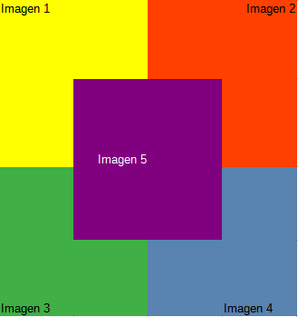

# Ej Grid 5


Design by Freepik

### Autor

Hugo Moruno Parra  

Daw 2 - I.E.S Castelar

<div style="page-break-after: always;"></div>

# Enunciado

Realiza una composición de imágenes utilizando CSS Grid en formato de 4x4 en la que superpongas 1 imagen y mediante Z-Index puedas seleccionar la imagen que queda por encima.



# Página web

Éste es el código que tendría nuestra página.

```html
<!DOCTYPE html>
<html lang="en">
<head>
    <meta charset="UTF-8">
    <meta name="viewport" content="width=device-width, initial-scale=1.0">
    <title>Document</title>
    <link rel="stylesheet" href="index.css">
</head>
<body>
    <main>
        <div>
            
        </div>
        <div>
            
        </div>
        <div>
            
        </div>
        <div>
            
        </div>
        <div>
            
        </div>
    </main>
</body>
</html>
```

<div style="page-break-after: always;"></div>

Y éste el código css.

```css
html, body
{
    height: 100%;
    width: 100%;
    margin: 0;
    
}
body
{
    display: flex;
    align-items: center;
    justify-content: center;
}
main
{
    display: grid;
    grid-template-columns: 1fr 1fr 1fr 1fr ; 
    grid-template-rows: 1fr 1fr 1fr 1fr ;
    grid-gap: 0;
}
div > img
{
    width: 350px;
    height: 350px;
    object-fit: cover;
}
div:nth-child(1)
{
    grid-area: 1 / 1 / 3 / 3;
}
div:nth-child(2)
{
    grid-area: 1 / 3 / 3 / 5;
}
div:nth-child(3)
{
    grid-area: 3 / 3 / 5 /5;
}
div:nth-child(4)
{
    grid-area: 3 / 1 / 5 / 3;
}
div:nth-child(5)
{
    grid-area: 2 / 2 / 4 / 4;
}
```

<div style="page-break-after: always;"></div>

# Preview


# Explicación

Página que distribuye su contenido de forma ordenada en base a el elemento grid.

# Conclusión

Muy útil en la muestra de elementos visuales o elementos de organización de contenido.
