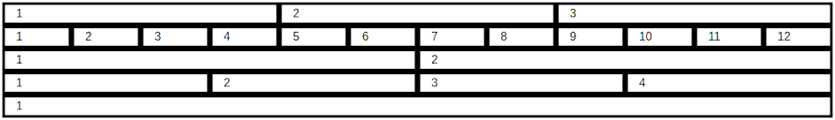
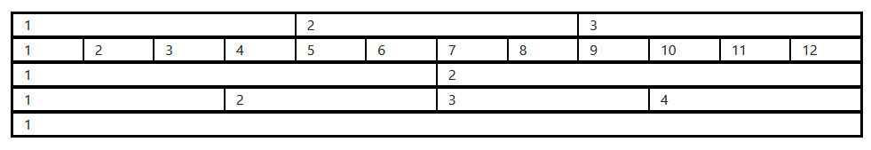

# Ej Bootstrap 1


Design by Freepik

### Autor

Hugo Moruno Parra  

Daw 2 - I.E.S Castelar

<div style="page-break-after: always;"></div>

# Enunciado

Utiliza ROW y COL. Sin tamaños, es decir, utiliza solo col. No uséis col-1, col-2,... Eso es para el siguiente ejercicio.



# Página web

Éste es el código que tendría nuestra página.

```html
<!DOCTYPE html>
<html lang="en">
<head>
    <meta charset="UTF-8">
    <meta name="viewport" content="width=device-width, initial-scale=1.0">
    <title>Document</title>

    <link href="https://cdn.jsdelivr.net/npm/bootstrap@5.3.3/dist/css/bootstrap.min.css" rel="stylesheet" integrity="sha384-QWTKZyjpPEjISv5WaRU9OFeRpok6YctnYmDr5pNlyT2bRjXh0JMhjY6hW+ALEwIH" crossorigin="anonymous">

    <script src="https://cdn.jsdelivr.net/npm/bootstrap@5.3.3/dist/js/bootstrap.bundle.min.js" integrity="sha384-YvpcrYf0tY3lHB60NNkmXc5s9fDVZLESaAA55NDzOxhy9GkcIdslK1eN7N6jIeHz" crossorigin="anonymous"></script>
    <link rel="stylesheet" href="index.css">
</head>
<body>
    
    <div id="table" class="container">
        <div class="row">
            <div class="col">1</div>
            <div class="col">2</div>
            <div class="col">3</div>
        </div>
        <div class="row">
            <div class="col">1</div>
            <div class="col">2</div>
            <div class="col">3</div>
            <div class="col">4</div>
            <div class="col">5</div>
            <div class="col">6</div>
            <div class="col">7</div>
            <div class="col">8</div>
            <div class="col">9</div>
            <div class="col">10</div>
            <div class="col">11</div>
            <div class="col">12</div>
        </div>
        <div class="row">
            <div class="col">1</div>
            <div class="col">2</div>
        </div>
        <div class="row">
            <div class="col">1</div>
            <div class="col">2</div>
            <div class="col">3</div>
            <div class="col">4</div>
        </div>
        <div class="row">
            <div class="col">1</div>
        </div>
    </div>

</body>
</html>
```

<div style="page-break-after: always;"></div>

Y éste el código css.

```css
html, body
{
    width: 100%;
    height: 100%;
}
body
{
    display: flex;
    align-items: center;
    justify-content: center;
}
#table
{
    border: 1px solid #000;
}
#table > .row
{
    border: 1px solid #000;
}
#table > .row > *
{
    border: 1px solid #000;
}
```

<div style="page-break-after: always;"></div>

# Preview



# Explicación

Utilización del framework de css, Bootstrap. Éste simplifica mucho la construcción de las páginas web.

# Conclusión

Bootstrap es una tecnología muy útil, tanto que incluso se pueden hacer páginas atractivas incluso sin archivo .css.