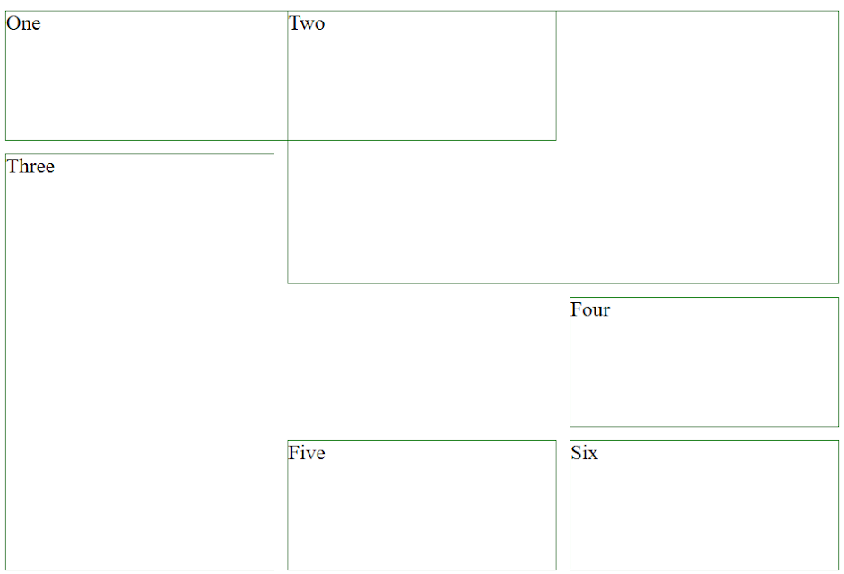

# Ej Grid 6


Design by Freepik

### Autor

Hugo Moruno Parra  

Daw 2 - I.E.S Castelar

<div style="page-break-after: always;"></div>

# Enunciado

Utiliza @media para dividir los dos diseños en un modelo de menor o igual a 768px y el segundo diseño mayor de 768 px.
Debéis usar display grid.

Más ayuda: https://developer.mozilla.org/es/docs/Web/CSS/CSS_grid_layout




# Página web

Éste es el código que tendría nuestra página.

```html
<!DOCTYPE html>
<html lang="en">
<head>
    <meta charset="UTF-8">
    <meta name="viewport" content="width=device-width, initial-scale=1.0">
    <title>Document</title>
    <link rel="stylesheet" href="index.css">
</head>
<body>
    <main>
        <div>One</div>
        <div>Two</div>
        <div>Three</div>
        <div>Four</div>
        <div>Five</div>
        <div>Six</div>
    </main>
</body>
</html>
```

<div style="page-break-after: always;"></div>

Y éste el código css.

```css
html, body
{
    height: 100%;
    width: 100%;
    margin: 0;
    
}
body
{
    display: flex;
    align-items: center;
    justify-content: center;
}

@media screen and (max-width: 768px) {
    main
    {
        display: grid;
        grid-template-columns: repeat(3, 200px) ; 
        grid-template-rows: repeat(4, 100px)  ;
        grid-gap: 10px;
    }
    div
    {
        border: 1px solid green;
    }
    div:nth-child(1)
    {
        grid-area: 1 / 1 / 2 / 3;
    }
    div:nth-child(2)
    {
        grid-area: 1 / 2 / 3 / 4;
    }
    div:nth-child(3)
    {
        grid-area: 2 / 1 / 5 / 2;
    }
    div:nth-child(4)
    {
        grid-area: 3 / 3 / 4 / 4;
    }
    div:nth-child(5)
    {
        grid-area: 4 / 2 / 5 / 3;
    }
    div:nth-child(6)
    {
        grid-area: 4 / 3 / 5 / 4;
    }
}

@media screen and (min-width: 768px) {
    main
    {
        display: grid;
        grid-template-columns: repeat(4, 150px) ; 
        grid-template-rows: repeat(5, 75px)  ;
        grid-gap: 10px;
    }
    div:nth-child(1)
    {
        border: 1px solid darkgreen;
        grid-area: 2 / 1 / 5 / 2;
    }
    div:nth-child(2)
    {
        border: 1px solid red;
        grid-area: 1 / 1 / 3 / 4;
    }
    div:nth-child(3)
    {
        border: 2px solid blue;
        grid-area: 3 / 1 / 5 / 3;
    }
    div:nth-child(4)
    {
        border: 1px solid lightgreen;
        grid-area: 1 / 4 / 4 / 5;
    }
    div:nth-child(5)
    {
        border: 1px solid lightsalmon;
        grid-area: 3 / 3 / 6 / 4;
    }
    div:nth-child(6)
    {
        border: 1px solid lightgreen;
        grid-area: 4 / 1 / 6 / 5;
    }
}
```

<div style="page-break-after: always;"></div>

# Preview


# Explicación

Utilización de los condicionales de css, en éste caso, @media - screen.

# Conclusión

Apartado muy útil y muy usado por casi todas las páginas web. Aunque el desarrollo del mismo se simplifica mucho con el estandar de frameworks css.