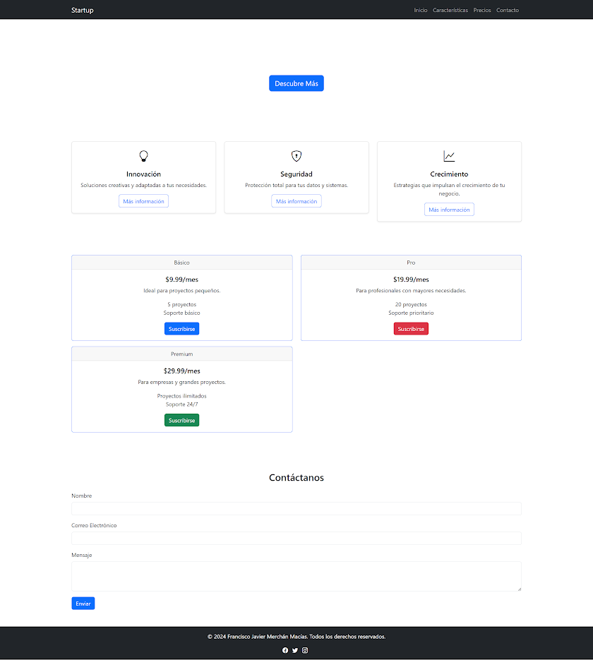
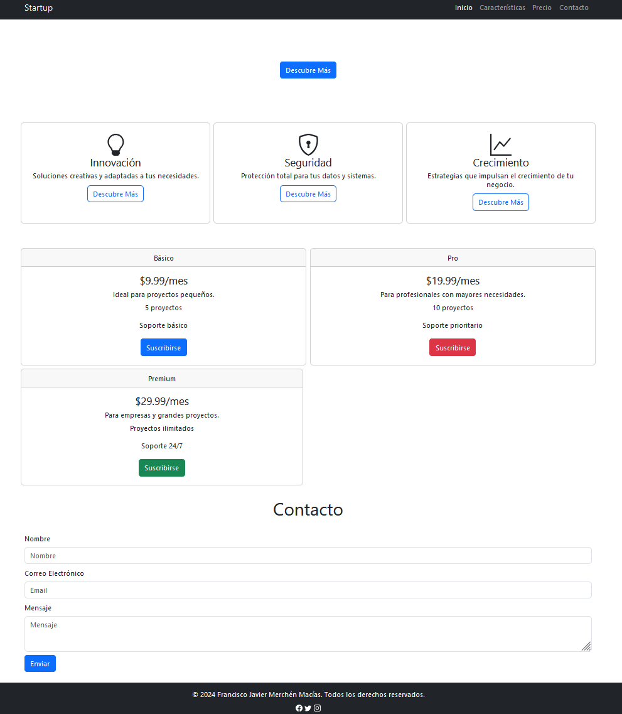

# Ej Bootstrap 3


Design by Freepik

### Autor

Hugo Moruno Parra  

Daw 2 - I.E.S Castelar

<div style="page-break-after: always;"></div>

# Enunciado



<div style="page-break-after: always;"></div>

# Página web

Éste es el código que tendría nuestra página.

```html
<!DOCTYPE html>
<html lang="en">

<head>
    <meta charset="UTF-8">
    <meta name="viewport" content="width=device-width, initial-scale=1.0">
    <title>Document</title>

    <link href="https://cdn.jsdelivr.net/npm/bootstrap@5.3.3/dist/css/bootstrap.min.css" rel="stylesheet"
        integrity="sha384-QWTKZyjpPEjISv5WaRU9OFeRpok6YctnYmDr5pNlyT2bRjXh0JMhjY6hW+ALEwIH" crossorigin="anonymous">

    <script src="https://cdn.jsdelivr.net/npm/bootstrap@5.3.3/dist/js/bootstrap.bundle.min.js"
        integrity="sha384-YvpcrYf0tY3lHB60NNkmXc5s9fDVZLESaAA55NDzOxhy9GkcIdslK1eN7N6jIeHz"
        crossorigin="anonymous"></script>
    <link rel="stylesheet" href="index.css">
</head>

<body>
    <nav class="navbar navbar-expand-lg navbar-dark bg-dark h-fit">
        <div class="container container-fluid">
            <a class="navbar-brand" href="#">Startup</a>
            <div>
                <button class="navbar-toggler" type="button" data-bs-toggle="collapse" data-bs-target="#navbarText"
                    aria-controls="navbarText" aria-expanded="false" aria-label="Toggle navigation">
                    <span class="navbar-toggler-icon"></span>
                </button>
                <div class="collapse navbar-collapse" id="navbarText">
                    <ul class="navbar-nav me-auto mb-2 mb-lg-0">
                        <li class="nav-item">
                            <a class="nav-link active" aria-current="page" href="#">Inicio</a>
                        </li>
                        <li class="nav-item">
                            <a class="nav-link" href="#">Características</a>
                        </li>
                        <li class="nav-item">
                            <a class="nav-link" href="#">Precio</a>
                        </li>
                        <li class="nav-item">
                            <a class="nav-link" href="#">Contacto</a>
                        </li>
                    </ul>
                </div>
            </div>
        </div>
    </nav>
    <main class="container">
        <div class="d-flex justify-content-center my-5">
            <button class="btn btn-primary my-5">Descubre Más</button>
        </div>
        <section class="row mb-5">
            <div class="card p-4 m-1 col text-center d-flex align-items-center">
                <svg xmlns="http://www.w3.org/2000/svg" width="16" height="16" fill="currentColor" class="bi bi-lightbulb" viewBox="0 0 16 16" style="width: 50px; height: 50px;">
                    <path d="..."/>
                </svg>
                <h4>Innovación</h4>
                <h6>Soluciones creativas y adaptadas a tus necesidades.</h6>
                <button class="btn btn-outline-primary my-1">Descubre Más</button>
            </div>
            <div class="card p-4 m-1 col text-center d-flex align-items-center">
                <svg xmlns="http://www.w3.org/2000/svg" width="16" height="16" fill="currentColor" class="bi bi-shield-lock" viewBox="0 0 16 16" style="width: 50px; height: 50px;">
                    <path d="..."/>
                </svg>
                <h4>Seguridad</h4>
                <h6>Protección total para tus datos y sistemas.</h6>
                <button class="btn btn-outline-primary my-1">Descubre Más</button>
            </div>
            <div class="card p-4 m-1 col text-center d-flex align-items-center">
                <svg xmlns="http://www.w3.org/2000/svg" width="16" height="16" fill="currentColor" class="bi bi-graph-up" viewBox="0 0 16 16" style="width: 50px; height: 50px;">
                    <path fill-rule="evenodd" d="..."/>
                </svg>
                <h4>Crecimiento</h4>
                <h6>Estrategias que impulsan el crecimiento de tu negocio.</h6>
                <button class="btn btn-outline-primary my-1">Descubre Más</button>
            </div>
        </section>
        <section class="text-center mt-5">
            <div class="row">
                <div class="card col m-1 d-flex justify-content-center p-0">
                    <div class="card-header">
                        Básico
                    </div>
                    <div class="my-3">
                        <h4>$9.99/mes</h4>
                        <h6>Ideal para proyectos pequeños.</h6>
                        <div class="d-flex flex-column align-items-center">
                            <p>5 proyectos</p>
                            <p>Soporte básico</p>
                        </div>
                        <button class="btn btn-primary my-1 mx-auto" style="width: fit-content;">Suscribirse</button>
                    </div>
                </div>
                <div class="card col m-1 d-flex justify-content-center p-0">
                    <div class="card-header">
                        Pro
                    </div>
                    <div class="my-3">
                        <h4>$19.99/mes</h4>
                        <h6>Para profesionales con mayores necesidades.</h6>
                        <div class="d-flex flex-column align-items-center">
                            <p>10 proyectos</p>
                            <p>Soporte prioritario</p>
                        </div>
                        <button class="btn btn-danger my-1 mx-auto" style="width: fit-content;">Suscribirse</button>
                    </div>
                </div>
            </div>
            <div class="row">
                <div class="card m-1 col d-flex justify-content-center p-0">
                    <div class="card-header">
                        Premium
                    </div>
                    <div class="my-3">
                        <h4>$29.99/mes</h4>
                        <h6>Para empresas y grandes proyectos.</h6>
                        <div class="d-flex flex-column align-items-center">
                            <p>Proyectos ilimitados</p>
                            <p>Soporte 24/7</p>
                        </div>
                        <button class="btn btn-success my-1 mx-auto" style="width: fit-content;">Suscribirse</button>
                    </div>
                </div>
                <div class="p-4 m-1 col-6">
                </div>
            </div>
        </section>
        <h1 class="text-center my-4">Contacto</h1>
        <form action="#" class="mt-3">
            <div class="mb-3">
                <label for="nombre" class="form-label mt-2">Nombre</label>
                <input type="text" class="form-control" name="" id="nombre" placeholder="Nombre" />

                <label for="email" class="form-label mt-2">Correo Electrónico</label>
                <input type="email" class="form-control" name="email" id="email"  placeholder="Email" />

                <label for="mensaje" class="form-label mt-2">Mensaje</label>
                <textarea class="form-control" name="mensaje" id="mensaje" placeholder="Mensaje"></textarea>
                
                <button type="submit" class="btn btn-primary my-2">Enviar</button>
            </div>
        </form>
    </main>
    <footer class="bg-dark">
        <div class="container d-flex flex-column align-items-center justify-content-center p-3">
            <h6 class="text-white">© 2024 Francisco Javier Merchén Macías. Todos los derechos reservados.</h6>
            <div>
                <svg xmlns="http://www.w3.org/2000/svg" width="16" height="16" fill="currentColor" class="bi bi-facebook text-white" viewBox="0 0 16 16">
                    <path d="..."/>
                </svg>
                <svg xmlns="http://www.w3.org/2000/svg" width="16" height="16" fill="currentColor" class="bi bi-twitter text-white" viewBox="0 0 16 16">
                    <path d="..."/>
                </svg>
                <svg xmlns="http://www.w3.org/2000/svg" width="16" height="16" fill="currentColor" class="bi bi-instagram text-white" viewBox="0 0 16 16">
                    <path d="..."/>
                </svg>
            </div>
        </div>
    </footer>
</body>
</html>
```

<div style="page-break-after: always;"></div>

Y éste el código css.

```css
html, body
{
    width: 100%;
    height: 100%;
}
```

<div style="page-break-after: always;"></div>

# Preview




<div style="page-break-after: always;"></div>

# Explicación

Ejercicio de supuesto real, se usan muchas clases de bootstrap.

# Conclusión

Muy útil, un ejemplo muy completo y entretenido.