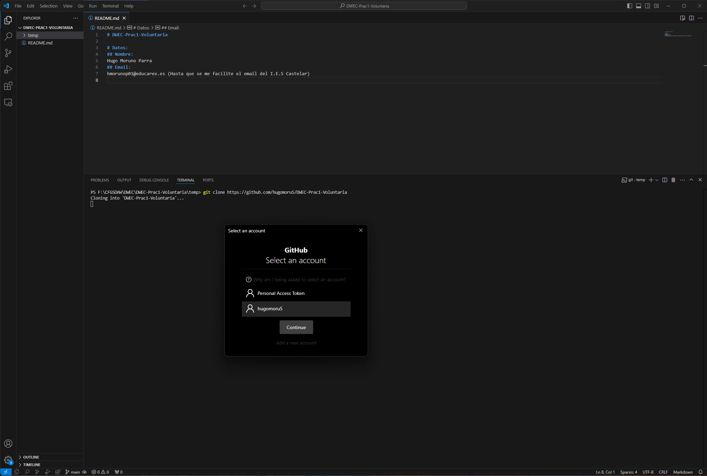
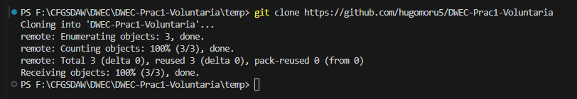
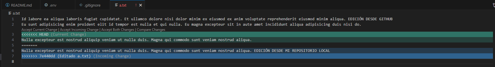
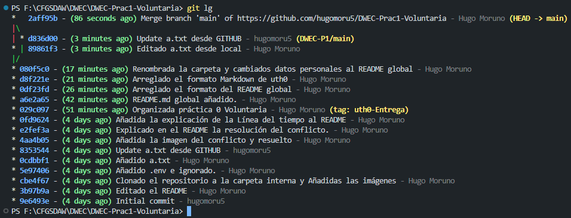
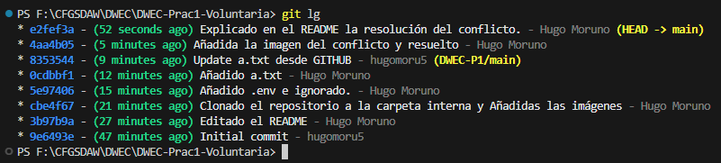

# DWEC-Prac1-Voluntaria

- [ ] Crea una cuenta en github (con el email corporativo).
- [x] Crea un repositorio privado (vacío).
- [x] Sigue los pasos que te proporciona para crear un git local o subir uno existente.
- [x] Crea un README.md con:
        1. Autor del repositorio
        2. eMail de contacto (corporativo)
        3. Crea un directorio para la UT1 con un README.md donde documentes esta práctica.
- [x] En otra carpeta, clona tu repositorio remoto.
        1. Captura de pantalla.
        2. Súbela a ./img
        3. Enlázala al README de la práctica.
- [x] Crea un archivo “a.txt” con 3 líneas y sincroniza con el repositorio remoto.
- [x] Modifica la primera línea del archivo en la web y la tercera en local con contenidos distintos e intenta sincronizarlos. Captura el conflicto y añádelo a la documentación.
- [x] Busca la estrategia de solucionar el conflicto y realiza un merge.
- [x] Captura la línea del tiempo.
- [x] Regresa al punto 7 (en el tiempo) y muestra el contenido del archivo a.txt mediante una captura.
- [x] Vuelve al HEAD y documentalo todo.

## Clonación del Proyecto en la carpeta temp

### Comando y ventana de confirmación

### Ejecución

## Conflicto provocado en el repositorio en linea

El conflicto se ha solucionado mediante el asistente de código de VSCode.
Una vez resuelto se ha cerrado la incidencia con el comando: __git rebase --continue__

## Conflicto provocado (Resuelto de forma correcta)

El conflicto se ha resuelto haciendo un Merge con el DETACHED_HEAD y el commit local.

## Línea del tiempo generada por git

Se ha usado el comando:  
__git log --graph --abbrev-commit --decorate --format=format:'%C(bold blue)%h%C(reset) - %C(bold green)(%ar)%C(reset) %C(white)%s%C(reset) %C(dim white)- %an%C(reset)%C(bold yellow)%d%C(reset)' --all__

