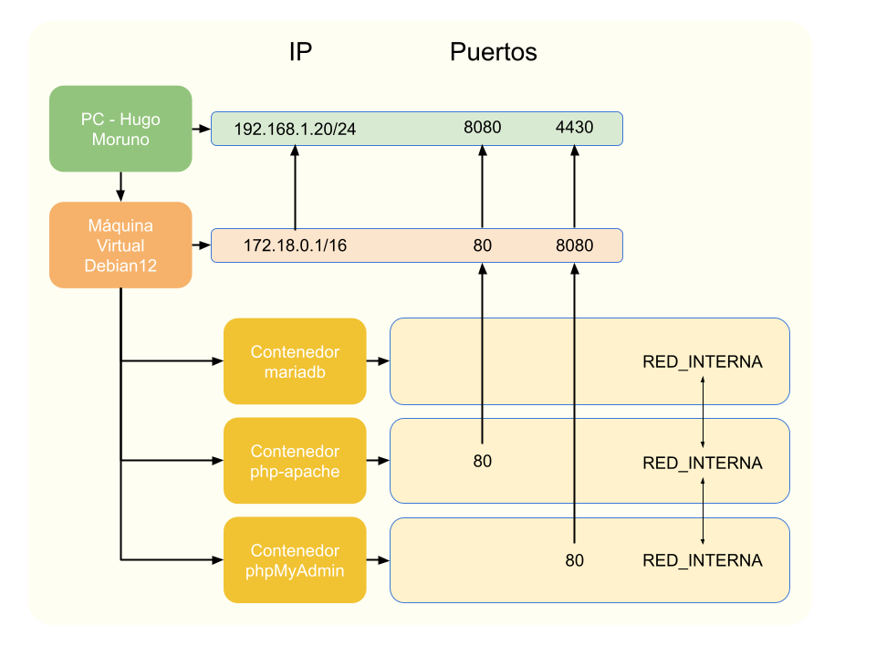

# DEAPW - Introducción a Docker CLI, Hugo Moruno

## Índice

1. [Requisitos](#lista-de-requisitos)
2. [Base del Ejercicio](#base-del-ejercicio)
3. [Núcleo del Ejercicio](#núcleo-del-ejercicio)
    - [Mariadb](#microservicio-mariadb)
    - [Apache](#microservicio-php-apache)
    - [PhpMyAdmin](#microservicio-phpmyadmin)  
4. [Conclusión](#conclusión)
5. [Instrucciones Vagrantfile](#instrucciones-vagrantfile)


## Lista de requisitos 

[-> Índice](#índice)

- [x] Crear la máquina virtual. (Explicación)
- [x] Estructura, red interna.
- [x] Creación del microservicio: mariaDB.
    1. Accesible sólo desde la red interna.
    2. Usuario 'pepe' y contraseña 'despliegue'.
- [x] Creación del microservicio: php-apache.
    1. Con acceso a 'mariaDB'.
    2. Puerto 80.
    3. Debe contener un 'phpinfo()' en el archivo 'info.php'.
- [x] Creación del microservicio: phpMyAdmin.
    1. Con acceso a 'mariaDB'.
    2. Accesible desde el mundo en el puerto 8080 o 443.
    3. Usar la variable de entorno: PMA_HOST=nombre_contenedor_mariaDB.
- [x] Creación del archivo vagrant y explicación para la ejecución y puesta en marcha del mismo.

## Base del ejercicio 

[-> Índice](#índice)

*Vagrant y VirtualBox*

#### Requisitos del ejercicio

- Máquina con Windows 10 o superior.
- Conexión a internet.
- Instalación de Vagrant 2.x.x.
- Instalación de VirtualBox 7.0.x (Las distribuciones de 7.1.x no soportan vagrant; 3/10/2024).

#### Pasos

- Una vez hecho todo lo anterior, comenzaremos creando una máquina virtual genérica con el sistema debian12 (3/10/2024; v4.3.12 [Vagrant box debian12](https://app.vagrantup.com/generic/boxes/debian12)) basado en la versión del núcleo de Linux: 6.1.0-17-amd64

    - Para ello abriremos una terminal en powershell y nos situamos en la carpeta que deseemos.
    - Una vez situados, ejecutaremos el siguiente comando:
    ```powershell
        vagrant init generic/debian12
    ```

    ##### vagrantfile

    - Debemos comprobar que se nos ha creado el archivo *vagrantfile* sin extensión.
    - Una vez creado, sustituiremos todo su contenido por el siguiente:
    ```ruby
    Vagrant.configure("2") do |config|
    config.vm.box = "generic/debian12"  #Selecciona y descarga la última versión de debian12
    config.vm.synced_folder "./vmfiles", "/vagrant" #Monta el volúmen de la MV en el directorio del contenedor
    config.vm.provision "shell", path: "provision.sh" #Ejecuta el contenido del archivo provision.sh en la máquina recién creada
    config.vm.network "forwarded_port", guest: 80, host: 8080 #Mapeo del puerto 80 (puerto para acceder a php-apache desde el mundo).
    config.vm.network "forwarded_port", guest: 8080, host: 4430 #Mapeo del puerto 8080 (puerto para acceder a phpMyAdmin desde el mundo).
    end
    ```

    - Ahora, crearemos el archivo provision.sh e introduciremos el siguiente contenido:

    ```bash
    apt-get update && apt-get install -y curl

    sudo -u vagrant docker --version
    if [[ ! $? -eq 0 ]]; then
        sudo -u vagrant curl -fsSL https://get.docker.com -o install-docker.sh
        sh install-docker.sh

        groupadd docker
        usermod -aG docker vagrant
    fi
    sudo -u vagrant docker --version

    ip a | grep "inet "
    ```

    [Apuntes luiscastelar github](https://github.com/luiscastelar/clases24_25/blob/main/comun/docker.md#preparaci%C3%B3n-para-aula)

    - En la misma carpeta, ejecutamos el comando:
    ```powershell
    vagrant up
    ```
    - Obtendremos la siguiente salida por consola (En caso de que ya tengas en tu máquina la imagen de generic/debian12, si no la tienes la descargará):
    [Consola del comando Vagrant Up](./documents/vagrant-up.txt)

## Núcleo del Ejercicio 

[-> Índice](#índice)

*ADVERTENCIA*

Todos los comandos a continuación se ejecutan dentro de la máquina virtual, para ello debemos hacer lo siguiente:
1. Comprobar el hash de las máquinas disponibles:
```powershell
    vagrant global-status

    PS E:\DEAPW-Hugo-Moruno\ut1-Docker\files> vagrant global-status
    id       name    provider   state   directory
    --------------------------------------------------------------------------
    84bed71  default virtualbox running E:/Vagrant
    ebe1aea  default virtualbox running E:/DEAPW-Hugo-Moruno/ut1-Docker/files
```
2. Una vez comprobado, copiamos el que nos interesa, en este caso **ebe1aea**.
3. Ahora ejecutamos el siguiente comando:
```powershell
    vagrant ssh ebe1aea

    PS E:\DEAPW-Hugo-Moruno\ut1-Docker\files> vagrant ssh ebe1aea
    vagrant@debian12:~$     #Ya estamos dentro de la máquina.
```

*Docker CLI*

#### Red interna

Una vez configurada e instalada la MV con Docker, creamos una red interna con el siguiente comando de bash:
```bash
    docker network create --driver bridge RED_INTERNA
``` 

Nos devolverá un hash, en mi caso:
```bash
    vagrant@debian12:~$ docker network create --driver bridge RED_INTERNA
    d17e45176104513303846f96d77250780586a877cd359f2ad8cdbe8eea1d9a99
```

Breve explicación:
- docker network create: Crea una red dentro del entorno de Docker.
- --driver bridge: Especifíca que la red creada sea una vlan entre los contenedores y el host.
- RED_INTERNA: nombre de la red

### Microservicio: MariaDB 

[-> Índice](#índice)

*Contenedor de Docker*

#### Instalación

Para crear el contenedor dentro de la máquina de Docker, debemos insertar el siguiente comando:
```bash
    docker run -d \                         #Inicia el contenedor
    --name mariadb_cont \                   #Lo nombra
    --network RED_INTERNA \                 #Le asigna la red interna creada
    -e MYSQL_ROOT_PASSWORD=maria_db \       #Le asigna la contraseña de root
    -e MYSQL_USER=pepe \                    #Asigna el usuario
    -e MYSQL_PASSWORD=despliegue \          #Asigna la contraseña
    mariadb:latest                          #Selecciona la última version del contenedor de mariadb
```

Debería devolvernos una salida por consola similar a ésta:
```bash
    vagrant@debian12:~$ docker run -d \
        --name mariadb_cont \
        --network RED_INTERNA \
        -e MYSQL_ROOT_PASSWORD=maria_db \
        -e MYSQL_USER=pepe \
        -e MYSQL_PASSWORD=despliegue \
        mariadb:latest
    Unable to find image 'mariadb:latest' locally
    latest: Pulling from library/mariadb
    eda6120e237e: Pull complete
    3bea7484bf1d: Pull complete
    97768484d3db: Pull complete
    f7c4ca00d7c4: Pull complete
    200feec9a56a: Pull complete
    4c3b42e2cd08: Pull complete
    e287e4cde285: Pull complete
    c19c18c0f9a2: Pull complete
    Digest: sha256:9e7695800ab8fa72d75053fe536b090d0c9373465b32a073c73bc7940a2e8dbe
    Status: Downloaded newer image for mariadb:latest
    1c9f58c19b4ed49ccde9d8701d8aa1ca00ba980325ecfa31af7e97ad29b61ea4
```

#### Explicación

Con ello hemos creado el contenedor de mariaDB visible únicamente dentro de la máquina. Éste tiene un usuario de mariaDB 'pepe' con contraseña 'despliegue' y una contraseña de root 'maria_db'.

### Microservicio: php-apache 

[-> Índice](#índice)

*Contenedor de Docker*

#### Pasos previos

Antes de crear el servidor de php-apache, hayq ue crear el archivo en un directorio raíz, para ello ejecutaremos el siguiente grupo de comandos uno por uno.


```bash
    sudo mkdir /php-apache && sudo touch /php-apache/info.php
    sudo chmod -R o+rw /php-apache
    echo "<?php phpinfo(); ?>" >> /php-apache/info.php
```

Breve explicación:
- sudo mkdir /php-apache && sudo touch /php-apache/info.php: crea el directorio en la raíz y el archivo de info.php
- sudo chmod -R o+rw /php-apache: permite leer y escribir el directorio (y su contenido) a todos los usuarios del sistema.
- echo "<?php phpinfo(); ?>" >> /php-apache/info.php: introduce la línea de php que ejecuta el phpinfo() en el archivo indicado anteriormente.

Una vez ejecutados, deberíamos obtener la siguiente información si abrimos el archivo (cat):

```bash
    vagrant@debian12:/$ sudo mkdir /php-apache && sudo touch /php-apache/info.php
    vagrant@debian12:/$ sudo chmod -R o+rw /php-apache
    vagrant@debian12:/$ echo "<?php phpinfo(); ?>" >> /php-apache/info.php
    vagrant@debian12:/$ cat /php-apache/info.php
    <?php phpinfo(); ?>
```

#### Instalación

Para crear el contenedor dentro de la máquina de Docker, debemos insertar el siguiente comando:
```bash
    docker run -d \                     #Inicia el contenedor
    --name apache_cont \                #Lo nombra
    --network RED_INTERNA \             #Le asigna la red interna creada
    -v /php-apache:/var/www/html \      #Asigna la carpeta local al directorio del contenedor
    -p 80:80 \                          #Mapea el puerto 80 del contenedor al de la máquina virtual
    php:apache                          #Descarga y selecciona la imagen de php apache (última versión)
```

Debería devolvernos una salida por consola similar a ésta:
```bash
    vagrant@debian12:/$ docker run -d \
        --name apache_cont \
        --network RED_INTERNA \
        -v /php-apache:/var/www/html \
        -p 80:80 \
        php:apache
    Unable to find image 'php:apache' locally
    apache: Pulling from library/php
    302e3ee49805: Pull complete
    07fc0890b857: Pull complete
    141aa7d58c57: Pull complete
    2720d4bca8b3: Pull complete
    82deca51468c: Pull complete
    dec741dfa526: Pull complete
    e204b0efab94: Pull complete
    87046c2c35e7: Pull complete
    3842de6108cf: Pull complete
    9a17887140a6: Pull complete
    9208c52a9c8e: Pull complete
    8d11d91a387d: Pull complete
    4ce4dac50170: Pull complete
    Digest: sha256:6d553ea70429a19fc1790cfd3796b4d456dbe48095e5c600756b31094fd44072
    Status: Downloaded newer image for php:apache
    70bc16084da5118fc7f3bb50cc78dc347455e118f1c2b5bb0e376c0468c82a36
```

#### Explicación

Con ello hemos creado el contenedor de php-apache visible desde el mundo entero a través del puerto 80 de la máquina virtual. Éste tiene mapeado el volúmen siguiente: la carpeta /php-apache de la máquina virtual en el contenedor, /var/www/html (carpeta que lee el servidor de php).

### Microservicio: phpMyAdmin 

[-> Índice](#índice)

*Contenedor de Docker*

#### Instalación

Para crear el contenedor dentro de la máquina de Docker, debemos insertar el siguiente comando:
```bash
    docker run -d \                 #Inicia el contenedor
    --name phpmyadmin_cont \        #Lo nombra
    --network RED_INTERNA \         #Le asigna la red interna creada
    -e PMA_HOST=mariadb_cont \      #Asigna a la variable interna PMA_HOST el nombre del servidor de bases de datos
    -p 8080:80 \                    #Asigna el puerto 8080 de la máquina virtual al puerto 80 del contenedor
    phpmyadmin/phpmyadmin           #Selecciona y descarga la última versión de phpmyadmin si no existe en el Docker local
```

Debería devolvernos una salida por consola similar a ésta:
```bash
    vagrant@debian12:/$ docker run -d \
        --name phpmyadmin_cont \
        --network RED_INTERNA \
        -e PMA_HOST=mariadb_cont \
        -p 8080:80 \
        phpmyadmin/phpmyadmin
    Unable to find image 'phpmyadmin/phpmyadmin:latest' locally
    latest: Pulling from phpmyadmin/phpmyadmin
    faef57eae888: Pull complete
    989a1d6c052e: Pull complete
    0705c9c2f22d: Pull complete
    621478e043ce: Pull complete
    98246dcca987: Pull complete
    bfed8c155cb6: Pull complete
    7a7c2e908867: Pull complete
    d176994b625c: Pull complete
    2d8ace6a2716: Pull complete
    c70df516383c: Pull complete
    15e1b44fe4c7: Pull complete
    65e50d44e95a: Pull complete
    77f68910bc0a: Pull complete
    605dd3a6e332: Pull complete
    99ce27188f07: Pull complete
    74d64e32c5d5: Pull complete
    ef5fc9928b9f: Pull complete
    163f3256e112: Pull complete
    Digest: sha256:67ba2550fd004399ab0b95b64021a88ea544011e566a9a1995180a3decb6410d
    Status: Downloaded newer image for phpmyadmin/phpmyadmin:latest
    be7892528e89b5bd4a241db20209c917ccc398d85d441c177e6b898a0d690303
```

#### Explicación

Con ello hemos creado el contenedor de phpMyAdmin visible desde el mundo entero a través del puerto 8080 de la máquina virtual. Éste tiene guardado en la variable de entorno PMA_HOST que guarda el nombre del servidor de bases de datos al que debe conectarse phpMyAdmin (mariadb_cont).

## Conclusión 

[-> Índice](#índice)

Estos pasos anteriormente explicados, detallan una estructura de Máquina virtual que tiene Docker instalado y 3 contenedores en su interior:

- mariadb
- php-apache
- phpMyAdmin

El mapa del entorno creado es el siguiente:


Cómo se puede ver a continuación, todos los contenedores tienen conexión entre ellos, con la máquina virtual y con el host.

Los ids de los contenedores:
```bash
    CONTAINER ID   NAME              CPU %     MEM USAGE / LIMIT     MEM %     NET I/O           BLOCK I/O         PIDS
    be7892528e89   phpmyadmin_cont   0.01%     42.46MiB / 1.921GiB   2.16%     9.42MB / 66.3kB   10.3MB / 31.4MB   7
    70bc16084da5   apache_cont       0.00%     45.37MiB / 1.921GiB   2.31%     9.44MB / 70.8kB   19.1MB / 31.5MB   7
    1c9f58c19b4e   mariadb_cont      0.04%     258MiB / 1.921GiB     13.12%    25.5MB / 176kB    30.4MB / 97.5MB   9
```
- phpMyAdmin:
    <details>

    ```bash
        root@70bc16084da5:/# ping -c4 apache_cont
        PING apache_cont (172.18.0.3) 56(84) bytes of data.
        64 bytes from 70bc16084da5 (172.18.0.3): icmp_seq=1 ttl=64 time=0.026 ms
        64 bytes from 70bc16084da5 (172.18.0.3): icmp_seq=2 ttl=64 time=0.044 ms
        64 bytes from 70bc16084da5 (172.18.0.3): icmp_seq=3 ttl=64 time=0.043 ms
        64 bytes from 70bc16084da5 (172.18.0.3): icmp_seq=4 ttl=64 time=0.042 ms

        --- apache_cont ping statistics ---
        4 packets transmitted, 4 received, 0% packet loss, time 3048ms
        rtt min/avg/max/mdev = 0.026/0.038/0.044/0.007 ms
        root@70bc16084da5:/# ping -c4 mariadb_cont
        PING mariadb_cont (172.18.0.2) 56(84) bytes of data.
        64 bytes from mariadb_cont.RED_INTERNA (172.18.0.2): icmp_seq=1 ttl=64 time=0.052 ms
        64 bytes from mariadb_cont.RED_INTERNA (172.18.0.2): icmp_seq=2 ttl=64 time=0.058 ms
        64 bytes from mariadb_cont.RED_INTERNA (172.18.0.2): icmp_seq=3 ttl=64 time=0.054 ms
        64 bytes from mariadb_cont.RED_INTERNA (172.18.0.2): icmp_seq=4 ttl=64 time=0.061 ms

        --- mariadb_cont ping statistics ---
        4 packets transmitted, 4 received, 0% packet loss, time 3030ms
        rtt min/avg/max/mdev = 0.052/0.056/0.061/0.003 ms
        root@70bc16084da5:/# ping 172.18.0.1
        PING 172.18.0.1 (172.18.0.1) 56(84) bytes of data.
        64 bytes from 172.18.0.1: icmp_seq=1 ttl=64 time=0.780 ms
        64 bytes from 172.18.0.1: icmp_seq=2 ttl=64 time=0.057 ms
        64 bytes from 172.18.0.1: icmp_seq=3 ttl=64 time=0.055 ms
        64 bytes from 172.18.0.1: icmp_seq=4 ttl=64 time=0.054 ms
        64 bytes from 172.18.0.1: icmp_seq=5 ttl=64 time=0.060 ms
        64 bytes from 172.18.0.1: icmp_seq=6 ttl=64 time=0.054 ms
        64 bytes from 172.18.0.1: icmp_seq=7 ttl=64 time=0.064 ms
        64 bytes from 172.18.0.1: icmp_seq=8 ttl=64 time=0.054 ms
        64 bytes from 172.18.0.1: icmp_seq=9 ttl=64 time=0.070 ms
        64 bytes from 172.18.0.1: icmp_seq=10 ttl=64 time=0.056 ms
        64 bytes from 172.18.0.1: icmp_seq=11 ttl=64 time=0.065 ms
        64 bytes from 172.18.0.1: icmp_seq=12 ttl=64 time=0.069 ms
        64 bytes from 172.18.0.1: icmp_seq=13 ttl=64 time=0.054 ms
        64 bytes from 172.18.0.1: icmp_seq=14 ttl=64 time=0.056 ms
        ^C
        --- 172.18.0.1 ping statistics ---
        14 packets transmitted, 14 received, 0% packet loss, time 13286ms
        rtt min/avg/max/mdev = 0.054/0.110/0.780/0.185 ms
        root@70bc16084da5:/# ping -c4 192.168.1.20
        PING 192.168.1.20 (192.168.1.20) 56(84) bytes of data.
        64 bytes from 192.168.1.20: icmp_seq=1 ttl=127 time=2.79 ms
        64 bytes from 192.168.1.20: icmp_seq=2 ttl=127 time=0.624 ms
        64 bytes from 192.168.1.20: icmp_seq=3 ttl=127 time=0.658 ms
        64 bytes from 192.168.1.20: icmp_seq=4 ttl=127 time=0.638 ms

        --- 192.168.1.20 ping statistics ---
        4 packets transmitted, 4 received, 0% packet loss, time 3012ms
        rtt min/avg/max/mdev = 0.624/1.178/2.793/0.932 ms
    ```

    </details>

- php-apache:
    <details>

    ```bash
        root@be7892528e89:/var/www/html# ping -c4 phpmyadmin_cont
        PING phpmyadmin_cont (172.18.0.4) 56(84) bytes of data.
        64 bytes from be7892528e89 (172.18.0.4): icmp_seq=1 ttl=64 time=0.109 ms
        64 bytes from be7892528e89 (172.18.0.4): icmp_seq=2 ttl=64 time=0.051 ms
        64 bytes from be7892528e89 (172.18.0.4): icmp_seq=3 ttl=64 time=0.042 ms
        64 bytes from be7892528e89 (172.18.0.4): icmp_seq=4 ttl=64 time=0.066 ms

        --- phpmyadmin_cont ping statistics ---
        4 packets transmitted, 4 received, 0% packet loss, time 3063ms
        rtt min/avg/max/mdev = 0.042/0.067/0.109/0.025 ms
        root@be7892528e89:/var/www/html# ping -c4 mariadb_cont
        PING mariadb_cont (172.18.0.2) 56(84) bytes of data.
        64 bytes from mariadb_cont.RED_INTERNA (172.18.0.2): icmp_seq=1 ttl=64 time=0.035 ms
        64 bytes from mariadb_cont.RED_INTERNA (172.18.0.2): icmp_seq=2 ttl=64 time=0.056 ms
        64 bytes from mariadb_cont.RED_INTERNA (172.18.0.2): icmp_seq=3 ttl=64 time=0.062 ms
        64 bytes from mariadb_cont.RED_INTERNA (172.18.0.2): icmp_seq=4 ttl=64 time=0.071 ms

        --- mariadb_cont ping statistics ---
        4 packets transmitted, 4 received, 0% packet loss, time 3031ms
        rtt min/avg/max/mdev = 0.035/0.056/0.071/0.013 ms
        root@be7892528e89:/var/www/html# ping -c4 172.18.0.1
        PING 172.18.0.1 (172.18.0.1) 56(84) bytes of data.
        64 bytes from 172.18.0.1: icmp_seq=1 ttl=64 time=0.608 ms
        64 bytes from 172.18.0.1: icmp_seq=2 ttl=64 time=0.053 ms
        64 bytes from 172.18.0.1: icmp_seq=3 ttl=64 time=0.054 ms
        64 bytes from 172.18.0.1: icmp_seq=4 ttl=64 time=0.057 ms

        --- 172.18.0.1 ping statistics ---
        4 packets transmitted, 4 received, 0% packet loss, time 3061ms
        rtt min/avg/max/mdev = 0.053/0.193/0.608/0.239 ms
        root@be7892528e89:/var/www/html# ping -c4 192.168.1.20
        PING 192.168.1.20 (192.168.1.20) 56(84) bytes of data.
        64 bytes from 192.168.1.20: icmp_seq=1 ttl=127 time=1.28 ms
        64 bytes from 192.168.1.20: icmp_seq=2 ttl=127 time=0.469 ms
        64 bytes from 192.168.1.20: icmp_seq=3 ttl=127 time=0.591 ms
        64 bytes from 192.168.1.20: icmp_seq=4 ttl=127 time=0.464 ms

        --- 192.168.1.20 ping statistics ---
        4 packets transmitted, 4 received, 0% packet loss, time 3051ms
        rtt min/avg/max/mdev = 0.464/0.702/1.284/0.339 ms
    ```

    </details>


- mariadb:
    <details>

    ```bash
        root@1c9f58c19b4e:/# ping -c4 apache_cont
        PING apache_cont (172.18.0.3) 56(84) bytes of data.
        64 bytes from apache_cont.RED_INTERNA (172.18.0.3): icmp_seq=1 ttl=64 time=0.111 ms
        64 bytes from apache_cont.RED_INTERNA (172.18.0.3): icmp_seq=2 ttl=64 time=0.056 ms
        64 bytes from apache_cont.RED_INTERNA (172.18.0.3): icmp_seq=3 ttl=64 time=0.052 ms
        64 bytes from apache_cont.RED_INTERNA (172.18.0.3): icmp_seq=4 ttl=64 time=0.056 ms

        --- apache_cont ping statistics ---
        4 packets transmitted, 4 received, 0% packet loss, time 3061ms
        rtt min/avg/max/mdev = 0.052/0.068/0.111/0.024 ms
        root@1c9f58c19b4e:/# ping -c4 phpmyadmin_cont
        PING phpmyadmin_cont (172.18.0.4) 56(84) bytes of data.
        64 bytes from phpmyadmin_cont.RED_INTERNA (172.18.0.4): icmp_seq=1 ttl=64 time=0.057 ms
        64 bytes from phpmyadmin_cont.RED_INTERNA (172.18.0.4): icmp_seq=2 ttl=64 time=0.057 ms
        64 bytes from phpmyadmin_cont.RED_INTERNA (172.18.0.4): icmp_seq=3 ttl=64 time=0.057 ms
        64 bytes from phpmyadmin_cont.RED_INTERNA (172.18.0.4): icmp_seq=4 ttl=64 time=0.056 ms

        --- phpmyadmin_cont ping statistics ---
        4 packets transmitted, 4 received, 0% packet loss, time 3042ms
        rtt min/avg/max/mdev = 0.056/0.056/0.057/0.000 ms
        root@1c9f58c19b4e:/# ping -c4 172.18.0.1
        PING 172.18.0.1 (172.18.0.1) 56(84) bytes of data.
        64 bytes from 172.18.0.1: icmp_seq=1 ttl=64 time=0.395 ms
        64 bytes from 172.18.0.1: icmp_seq=2 ttl=64 time=0.059 ms
        64 bytes from 172.18.0.1: icmp_seq=3 ttl=64 time=0.048 ms
        64 bytes from 172.18.0.1: icmp_seq=4 ttl=64 time=0.067 ms

        --- 172.18.0.1 ping statistics ---
        4 packets transmitted, 4 received, 0% packet loss, time 12973ms
        rtt min/avg/max/mdev = 0.048/0.142/0.395/0.146 ms
        root@1c9f58c19b4e:/# ping -c4 192.168.1.20
        PING 192.168.1.20 (192.168.1.20) 56(84) bytes of data.
        64 bytes from 192.168.1.20: icmp_seq=1 ttl=127 time=1.11 ms
        64 bytes from 192.168.1.20: icmp_seq=2 ttl=127 time=0.637 ms
        64 bytes from 192.168.1.20: icmp_seq=3 ttl=127 time=0.662 ms
        64 bytes from 192.168.1.20: icmp_seq=4 ttl=127 time=0.695 ms

        --- 192.168.1.20 ping statistics ---
        4 packets transmitted, 4 received, 0% packet loss, time 3008ms
        rtt min/avg/max/mdev = 0.637/0.776/1.113/0.195 ms
        root@1c9f58c19b4e:/#
    ```

    </details>

Una vez comprobado que la red interna funciona perfectamente, sabemos que, si la instalación se hace en una maquina virtual de un vps, los puertos de la ip (dentro del ejercicio son los de Mi ordenador ([Diagrama](#conclusión))) serán accesibles desde el alojamiento de la máquina del vps.

## Instrucciones Vagrantfile 

[-> Índice](#índice)

Para poder instalar todo lo ejecutado anteriormente, de manera cómoda y desatendida, nos aseguraremos de lo siguiente:

1. Tener en una carpeta dentro de un sistema windows cualquiera lo siguiente:  
- Una carpeta llamada "vmfiles".  
- El archivo ["vagrantfile"](#vagrantfile)  
- El archivo ["provision.sh"](provision.sh)  
- (Ambos archivos, vagrantfile y provision.sh están en el repositorio donde se encuentra este [README.md](./README.md))  
2. Ejecutar dentro de la carpeta donde se encuentren estos archivos el comando:
        ```
        vagrant up
        ```
3. Comprobar que se haya ejecutado correctamente con los siguiente comandos:  
- Comprobar máquina virtual:
        ```
        vagrant global status
        ```  

- Entonces aparecerá la máquina creada y el hash correspondiente.  
- Entrar en la máquina usando:
        ```
            vagrant ssh (reemplazar por el código/hash).
        ```

- Una vez dentro, ejecutar el siguiente comando:
        ```
            docker stats
        ```

- Una vez ejecutado te saldrá el estado de los contenedores instalados.
- Como comprobación final, en la máquina windows donde se aloja todo, ve a un buscador e introduce: http://localhost:8080/info.php y debería aparecer toda la información del contenedor de apache.