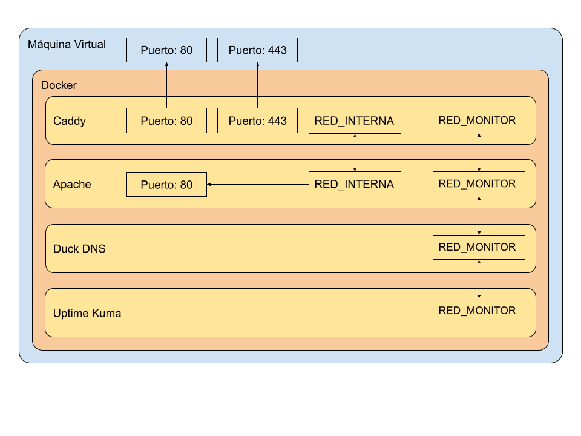
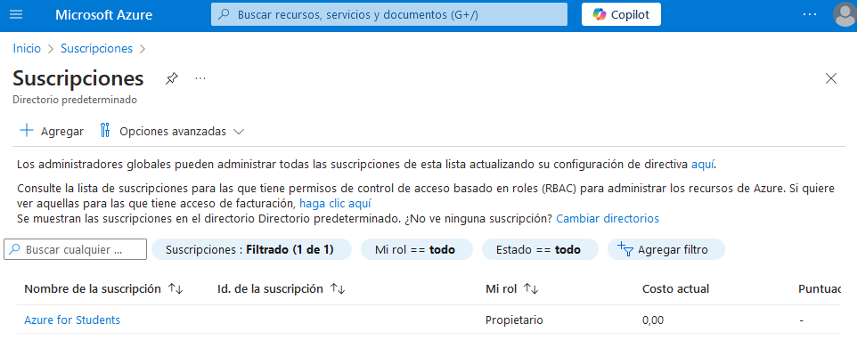
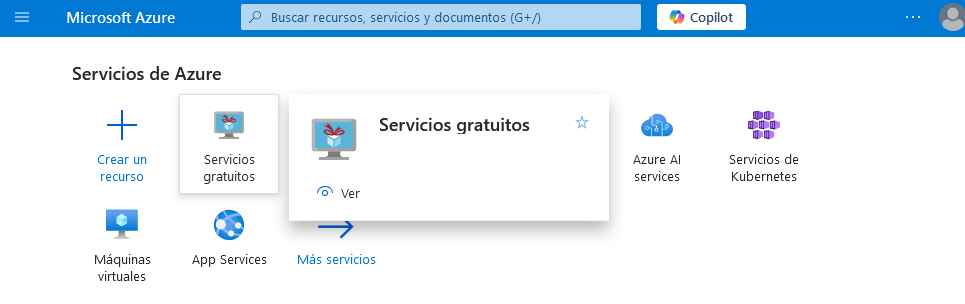
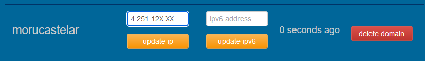
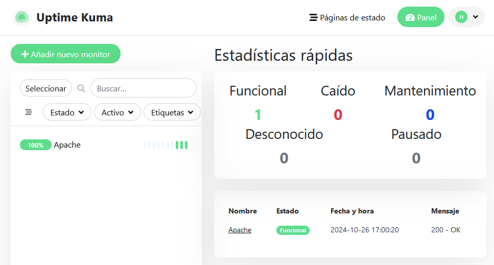
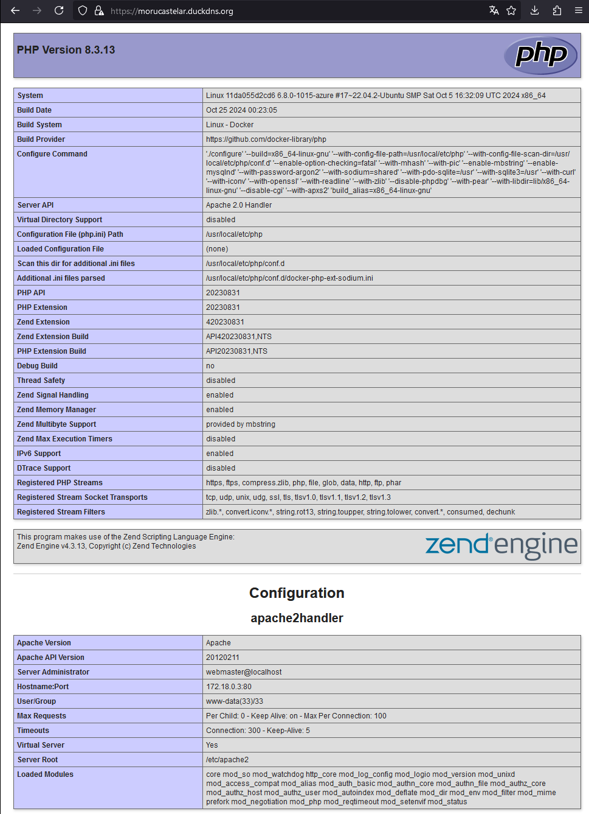

# Práctica pre-examen del 28 de Octubre de 2024

## Índice

- [Práctica pre-examen del 28 de Octubre de 2024](#práctica-pre-examen-del-28-de-octubre-de-2024)
  - [Índice](#índice)
  - [Lista de requisitos](#lista-de-requisitos)
  - [Explicación del ejecicio](#explicación-del-ejecicio)
  - [Base del ejercicio](#base-del-ejercicio)
  - [Inicio y configuración de la máquina virtual online](#inicio-y-configuración-de-la-máquina-virtual-online)
  - [Instalación de Docker](#instalación-de-docker)
  - [Obtención del Dominio e Instalación del contendor autoupdater de DuckDNS](#obtención-del-dominio-e-instalación-del-contendor-autoupdater-de-duckdns)
  - [Corrección de la conexión](#corrección-de-la-conexión)
  - [Creación de la red interna para los contenedores Caddy y Apache](#creación-de-la-red-interna-para-los-contenedores-caddy-y-apache)
  - [Instalación y configuración del contenedor de proxy inverso: Caddy](#instalación-y-configuración-del-contenedor-de-proxy-inverso-caddy)
  - [Instalación y configuración del contenedor de Apache: httpd](#instalación-y-configuración-del-contenedor-de-apache-httpd)
  - [Instalación y configuración del contenedor de Monitoración: uptime-kuma](#instalación-y-configuración-del-contenedor-de-monitoración-uptime-kuma)
  - [EXTRA: Hacerlo todo de golpe:](#extra-hacerlo-todo-de-golpe)

En ésta práctica se solicitan los siguientes requisitos:

## Lista de requisitos 

[-> Índice](#índice)

- [x] Crear máquina virtual en un Proveedor de Servidores Virtuales (VPS).
- [x] Instalar Docker en la máquina y configurarlo correctamente.
- [x] Asignar un dominio al servidor.
    - [x] Obtener un subdominio de la organización [Duck DNS](duckdns.org).
    - [x] Configurar el subdominio con el contenedor de DuckDNS.
- [x] Configurar el entorno de Docker para los contenedores.
    - [x] Instalar un proxy inverso para el manejo de peticiones.
    - [x] Instalar un servicio de páginas webs.
    - [x] Anonimizar cabeceras Apache.
    - [x] Instalar el servicio de Monitorización Uptime-Kuma.

## Explicación del ejecicio

[-> Índice](#índice)

Para resumir el ejercicio, voy a describirlo con un esquema. A mi gusto, a parte de visual, es más sencillo de interpretar y de ver. 

El esquema es el siguiente:


Cómo se puede ver en el esquema, el ejercicio se compone de 4 contenedores sobre Docker, sobre una máquina virtual que en mi caso será tipo _Ubuntu24.04 x64_.

El objetivo final será hacer que desde el mundo, el servidor muestre las páginas de Apache sin que las peticiones se realicen directamente al servidor apache. Ésto previene la posibilidad de malware y/o ataques.

En mi caso, he decidido instalar los contenedores en el siguiente orden: 

  - Duck DNS.
  - Caddy.
  - Apache.
  - Uptime-Kuma.

No tiene una razón específica, ya que una instalación correcta no debe interferir en el orden de los contenedores. En mi caso he elegido éste orden porque para mí es el más lógico.

## Base del ejercicio

[-> Índice](#índice)

A continuación (por básico que parezca) voy a enumerar los requisitos:

Necesitamos: 

  - Conexión a internet.
  - Una máquina personal (da igual si unix, macintosh o windows).
  - Una máquina virtual provista por un VPS.
  - Un navegador correctamente configurado para acceder mediante proxy al servidor.

Una vez tenemos los requisitos cumplimentados, procedemos a comenzar la instalación.

## Inicio y configuración de la máquina virtual online

[-> Índice](#índice)

En mi caso, he decidido usar Microsoft Azure para realizar la práctica. [Azure](https://portal.azure.com/)

Para comenzar, debemos repasar lo siguiente:

  - Comprobar (en nuestro particular caso) que tenemos la cuenta de Microsoft Students enlazada a nuestro correo corporativo: @iescastelar.com.
  - Obtener la suscripción de Azure for students.
  
  - Una vez tengamos la suscripción, vamos a Inicio y seleccionamos Servicios gratuitos.
  
  - Seleccionamos: *Máquina virtual con Linux*; pulsamos en *Crear*.
  - El formulario de creación, lo cumplimentamos de la siguiente manera:
    
    1. Suscripción: Azure for Students
    2. Grupo de recursos: _nombre que queramos asignar_
    3. Nombre de máquina virtual: _nombre que queramos asignar_
    4. Región: France Central (En otros casos puede no funcionar, no hay problema en elegir otras mientras sean Europeas)
    5. Imagen: Ubuntu Server 22.04 LTS - x64 gen. 2
    6. Tamaño: Standard_B1s - 1 vcpu, 1 GiB de memoria (8,61 US$/mes) (servicios gratuitos elegibles)
    7. Tipo de autenticación: Clave pública SSH
    8. Nombre de Usuario: _nombre que queramos asignar_  

    __Breve inciso__: Creación local de par de llaves.
    
    <details>
        ssh-keygen -t ed25519 
        # Este comando genera un par de llaves 
        # y a continuación te pide indicaciones.

        PS C:\Users\hugom> ssh-keygen -t ed25519
        Generating public/private ed25519 key pair.
        Enter file in which to save the key (C:\Users\hugom/.ssh/id_ed25519): llavesMoru
        Enter passphrase (empty for no passphrase):
        Enter same passphrase again:
        Your identification has been saved in llavesMoru
        Your public key has been saved in llavesMoru.pub
        The key fingerprint is:
        SHA256:MSKvvfmCvfxqxNYXpLvyXacn3Jtw3hL5lUcibnNWyVc hugom@M5
        The key's randomart image is:
        +--[ED25519 256]--+
        |                 |
        |          .     E|
        |    . . oo    . o|
        |     o ..o. . .o+|
        |     ...S. o . =o|
        |     o+ o . + =.o|
        |    .=.  o oo=ooo|
        |    ..=o.. .o*+o.|
        |     .*O+ . .o+o.|
        +----[SHA256]-----+
        # Esta es la salida por consola del comando. En mi caso, 
        # le he puesto de nombre llavesMoru, pero le puedes poner 
        # el nombre que quieras y las passphrase es una contraseña 
        # que se te pedirá siempre que uses el par de llaves, asi 
        # que apunta bien la contraseña.

        # Se me han generado los archivos en mi carpeta de usuario, 
        # como se puede ver a continuación:

        PS C:\Users\hugom> dir | findstr /i "llavesMoru"
        -a----        26/10/2024      0:52            444 llavesMoru
        -a----        26/10/2024      0:52             91 llavesMoru.pub
        PS C:\Users\hugom>

        # Debes moverlas a la carpeta .ssh de tu usuario

        PS C:\Users\hugom> mv ./llavesMoru ./.ssh/llavesMoru
        PS C:\Users\hugom> mv ./llavesMoru.pub ./.ssh/llavesMoru.pub

        # Ahora ya tienes las llaves listas para que se ejecuten de forma
        # automática en la conexión ssh.
    </details>

    9.  Origen de clave pública SSH: Usar la clave pública existente
    10. Clave pública SSH: _Introducimos el contenido de nuestro 
    archivo de llave pública, en mi caso: llaveMoru.pub.
    11. Puertos de entrada públicos: Permitir los puertos seleccionados
    12. Seleccionar puertos de entrada: HTTP (80), HTTPS (443), SSH (22);

Pulsamos en siguiente. 

Dejamos el apartado Etiquetas vacío.

Pulsamos en siguiente. 

Ahora deberían aparecerte los datos de tu "contrato", tus datos personales y 
los datos de la configuración que en mi caso son los siguientes:

    Datos básicos
    - Suscripción - Azure for Students
    - Grupo de recursos - (nuevo) hugo2
    - Nombre de máquina virtual - maquina02
    - Región - France Central
    - Imagen - Ubuntu Server 22.04 LTS - Gen2
    - Tamaño - Standard B1s (1 vcpu, 1 GiB de memoria)
    - Tipo de autenticación - Clave pública SSH
    - Nombre de usuario - hugomoruno
    - Formato de clave SSH - Ed25519
    - Puertos de entrada públicos - SSH, HTTP, HTTPS

Pulsamos en *Crear*

**¡Ya tenemos nuestra máquina!**

Ahora, entramos en la ventana de control de la máquina virtual. Y encontraremos 
la IP Pública, en mi caso: 4.251.12X.XX.

## Instalación de Docker 

[-> Índice](#índice)

Ahora, para poder iniciar los trabajos en la máquina virtual, debemos ejecutar el siguiente comando:
```powershell
ssh -i ~/.ssh/llavesMoru hugomoruno@4.251.12X.XX
```

Ejecutando este comando, accedemos a la máquina (en mi caso he usado 
-i para especificar qué llave quiero usar ya que tengo más de una en mi carpeta)    
<details>

    PS C:\Users\hugom\.ssh> ssh -i ~/.ssh/llavesMoru hugomoruno@4.251.12X.XX
    Enter passphrase for key 'C:\Users\hugom/.ssh/llavesMoru':
    Welcome to Ubuntu 22.04.5 LTS (GNU/Linux 6.5.0-1025-azure x86_64)

    * Documentation:  https://help.ubuntu.com
    * Management:     https://landscape.canonical.com
    * Support:        https://ubuntu.com/pro

    System information as of Fri Oct 25 23:20:16 UTC 2024

    System load:  0.13              Processes:             101
    Usage of /:   2.4% of 61.84GB   Users logged in:       0
    Memory usage: 31%               IPv4 address for eth0: 10.1.1.4
    Swap usage:   0%

    Expanded Security Maintenance for Applications is not enabled.

    0 updates can be applied immediately.

    Enable ESM Apps to receive additional future security updates.
    See https://ubuntu.com/esm or run: sudo pro status


    The list of available updates is more than a week old.
    To check for new updates run: sudo apt update


    The programs included with the Ubuntu system are free software;
    the exact distribution terms for each program are described in the
    individual files in /usr/share/doc/*/copyright.

    Ubuntu comes with ABSOLUTELY NO WARRANTY, to the extent permitted by
    applicable law.

    To run a command as administrator (user "root"), use "sudo <command>".
    See "man sudo_root" for details.

    hugomoruno@maquina02:~$
</details>

Ahora, procedemos a la instalación. Para ello, ejecutaremos los siguientes comandos:

```bash
curl -fsSL https://get.docker.com -o get-docker.sh
```
Obtiene el script de instalación automática de Docker.

```bash
sudo sh get-docker.sh
```
Ejecuta el script de forma desatendida.

Pongo como ejemplo mi salida:
<details>

    hugomoruno@maquina02:~$ curl -fsSL https://get.docker.com -o get-docker.sh
    hugomoruno@maquina02:~$ sudo sh get-docker.sh
    # Executing docker install script, commit: 6d51e2cd8c04b38e1c2237820245f4fc262aca6c
    + sh -c apt-get -qq update >/dev/null
    + sh -c DEBIAN_FRONTEND=noninteractive apt-get -y -qq install ca-certificates curl >/dev/null
    + sh -c install -m 0755 -d /etc/apt/keyrings
    + sh -c curl -fsSL "https://download.docker.com/linux/ubuntu/gpg" -o /etc/apt/keyrings/docker.asc
    + sh -c chmod a+r /etc/apt/keyrings/docker.asc
    + sh -c echo "deb [arch=amd64 signed-by=/etc/apt/keyrings/docker.asc] https://download.docker.com/linux/ubuntu jammy stable" > /etc/apt/sources.list.d/docker.list
    + sh -c apt-get -qq update >/dev/null
    + sh -c DEBIAN_FRONTEND=noninteractive apt-get -y -qq install docker-ce docker-ce-cli containerd.io docker compose-plugin docker-ce-rootless-extras docker-buildx-plugin >/dev/null
    + sh -c docker version
    Client: Docker Engine - Community
    Version:           27.3.1
    API version:       1.47
    Go version:        go1.22.7
    Git commit:        ce12230
    Built:             Fri Sep 20 11:41:00 2024
    OS/Arch:           linux/amd64
    Context:           default

    Server: Docker Engine - Community
    Engine:
    Version:          27.3.1
    API version:      1.47 (minimum version 1.24)
    Go version:       go1.22.7
    Git commit:       41ca978
    Built:            Fri Sep 20 11:41:00 2024
    OS/Arch:          linux/amd64
    Experimental:     false
    containerd:
    Version:          1.7.22
    GitCommit:        7f7fdf5fed64eb6a7caf99b3e12efcf9d60e311c
    runc:
    Version:          1.1.14
    GitCommit:        v1.1.14-0-g2c9f560
    docker-init:
    Version:          0.19.0
    GitCommit:        de40ad0

    ================================================================================

    To run Docker as a non-privileged user, consider setting up the
    Docker daemon in rootless mode for your user:

        dockerd-rootless-setuptool.sh install

    Visit https://docs.docker.com/go/rootless/ to learn about rootless mode.


    To run the Docker daemon as a fully privileged service, but granting non-root
    users access, refer to https://docs.docker.com/go/daemon-access/

    WARNING: Access to the remote API on a privileged Docker daemon is equivalent
            to root access on the host. Refer to the 'Docker daemon attack surface'
            documentation for details: https://docs.docker.com/go/attack-surface/

    ================================================================================

    hugomoruno@maquina02:~$
</details>

Una vez hecha la instalación base, vamos a instalar el módulo docker compose para poder levantar
las máquinas desde un archivo yaml.

Para ello:
```bash
sudo apt update
sudo apt install docker compose
```

¡Instalado! Ahora, hay que configurar nuestro usuario como usuario Docker, para ello:
```bash
sudo groupadd docker
sudo usermod -aG docker $USER
newgrp docker
```

Y si compruebo con el comando:
```bash
groups hugomoruno

#Ésta sería la salida
hugomoruno : hugomoruno adm dialout cdrom floppy sudo audio dip video plugdev netdev lxd **docker**
```

Como veo que ya está docker, está todo correcto.

## Obtención del Dominio e Instalación del contendor autoupdater de DuckDNS

[-> Índice](#índice)

Primero, accederemos a la página oficial de [DuckDNS](https://www.duckdns.org/).

Una vez hayamos accedido y nos hayamos registrado con nuestra cuenta (sea cual sea).
Procedemos a obtener un subdominio de duckdns.org. En mi caso:

  - morucastelar.duckdns.org
  
  

Una vez creado y asignado la IP, pulsamos en update IP y debe aparecer un mensaje de success.

Volvemos a la máquina virtual y en la carpeta que queramos (a poder ser en ~/ ), creamos una carpeta 
llamada duckdns.
```bash
mkdir duckdns
```
Dentro de la carpeta creamos el archivo docker-compose.yml.
```bash
touch ./duckdns/docker-compose.yml
```

En el archivo de compose introducimos el contenedor de DuckDNS composerized.
El contenido del composer lo tenemos en el repositorio de Docker Hub del grupo linuxserver
en la siguiente dirección: [duckdns](https://hub.docker.com/r/linuxserver/duckdns)

```yml
services:
duckdns:
    image: lscr.io/linuxserver/duckdns:latest
    container_name: duckdns
    network_mode: host #optional
    environment:
    - PUID=1000 #optional
    - PGID=1000 #optional
    - TZ=Etc/UTC #optional
    - SUBDOMAINS=morucastelar
    - TOKEN=4538f749-28b0-4b4e-8a73-xxxxxxxxxxxx
    - UPDATE_IP=ipv4 #optional
    - LOG_FILE=false #optional
    restart: unless-stopped
```

Ahora, nos situamos en la carpeta duckdns y ejecutamos el comando
```bash
docker compose up -d
```

Y la salida será la siguiente:
<details>

    hugomoruno@maquina02:~/duckdns$ docker compose up -d
    Pulling duckdns (lscr.io/linuxserver/duckdns:latest)...
    latest: Pulling from linuxserver/duckdns
    68c4ea3779b6: Pull complete
    df25a931801a: Pull complete
    ab0ddebe54a6: Pull complete
    19f39f464468: Pull complete
    7560e3e46aa2: Pull complete
    339ecd878087: Pull complete
    fdaf29876bfe: Pull complete
    c606a5b2fbbd: Pull complete
    Digest: sha256:48004b34e10de8749442d4834bfa55e842410ddb561caccca022532e496c8d2e
    Status: Downloaded newer image for lscr.io/linuxserver/duckdns:latest
    Creating duckdns ... done
    hugomoruno@maquina02:~/duckdns$
</details>

Comprobamos que se ha creado y levantado el contenedor con el comando:
```bash
docker ps

# Esta seria la salida.
hugomoruno@maquina02:~/duckdns$ docker ps
CONTAINER ID   IMAGE                                COMMAND   CREATED              STATUS              PORTS     NAMES
400dc058f682   lscr.io/linuxserver/duckdns:latest   "/init"   About a minute ago   Up About a minute             duckdns
```

## Corrección de la conexión

[-> Índice](#índice)

Una vez que hemos configurado correctamente el contenedor de DuckDNS, ya no necesitamos 
conectarnos al ssh a través de la IP Pública. Es por ello que comprobaremos lo siguiente:

```bash
exit
```
Nos situamos en la terminal de Powershell 
```powershell
ssh -i ~/.ssh/llavesMoru hugomoruno@morucastelar.duckdns.org
```
La consecución de los comandos debería verse así:
<details>

    hugomoruno@maquina02:~$ exit
    logout
    Connection to 4.251.12X.XX closed.
    PS C:\Users\hugom\.ssh> ssh -i ~/.ssh/llavesMoru hugomoruno@morucastelar.duckdns.org
    The authenticity of host 'morucastelar.duckdns.org (4.251.12X.XX)' can't be established.
    ED25519 key fingerprint is SHA256:znAPSgCrS5xWhqnCEroM5mX4VU4MHmahyHKC/lVGsOg.
    This host key is known by the following other names/addresses:
        C:\Users\hugom/.ssh/known_hosts:5: 4.251.12X.XX
    Are you sure you want to continue connecting (yes/no/[fingerprint])? yes
    Warning: Permanently added 'morucastelar.duckdns.org' (ED25519) to the list of known hosts.
    Enter passphrase for key 'C:\Users\hugom/.ssh/llavesMoru':
    Welcome to Ubuntu 22.04.5 LTS (GNU/Linux 6.5.0-1025-azure x86_64)

    * Documentation:  https://help.ubuntu.com
    * Management:     https://landscape.canonical.com
    * Support:        https://ubuntu.com/pro

    System information as of Sat Oct 26 00:03:56 UTC 2024

    System load:  0.0               Processes:             115
    Usage of /:   3.7% of 61.84GB   Users logged in:       0
    Memory usage: 40%               IPv4 address for eth0: 10.1.1.4
    Swap usage:   0%


    Expanded Security Maintenance for Applications is not enabled.

    19 updates can be applied immediately.
    17 of these updates are standard security updates.
    To see these additional updates run: apt list --upgradable

    Enable ESM Apps to receive additional future security updates.
    See https://ubuntu.com/esm or run: sudo pro status

    New release '24.04.1 LTS' available.
    Run 'do-release-upgrade' to upgrade to it.


    Last login: Fri Oct 25 23:20:18 2024 from XXX.XXX.XXX.XXX
    hugomoruno@maquina02:~$
</details>

## Creación de la red interna para los contenedores Caddy y Apache

[-> Índice](#índice)

Para la red ejecutaremos el siguiente comando:
```bash
docker network create red_interna
```

## Instalación y configuración del contenedor de proxy inverso: Caddy

[-> Índice](#índice)

Para empezar crearemos la estructura caddy en el mismo directorio donde se encuentra duckdns.
Es decir:
```bash
mkdir caddy
touch ./caddy/docker-compose.yml
```

E introduciremos el siguiente composer, del repositorio de [lucaslorentz](https://github.com/lucaslorentz/caddy-docker-proxy?tab=readme-ov-file#basic-usage-example-using-docker compose)

```yml
version: "3.7"
services:
caddy:
    image: lucaslorentz/caddy-docker-proxy:ci-alpine
    container_name: caddy
    ports:
        - 80:80
        - 443:443
    environment:
        - CADDY_INGRESS_NETWORKS=red_interna
    networks:
        - red_interna
    volumes:
        - /var/run/docker.sock:/var/run/docker.sock
        - caddy_data:/data
    restart: unless-stopped

networks:
    red_interna:
        external: true

volumes:
    caddy_data: {}
```

Ahora, una vez creado todo, nos situamos en la carpeta caddy. Y ejecutamos:
```bash
docker compose up -d
```

La salida debería ser la siguiente:
<details>

    hugomoruno@maquina02:~/caddy$ docker compose up -d
    Pulling caddy (lucaslorentz/caddy-docker-proxy:ci-alpine)...
    ci-alpine: Pulling from lucaslorentz/caddy-docker-proxy
    c158987b0551: Pull complete
    97ee13ebe9f0: Pull complete
    12d510dcf679: Pull complete
    Digest: sha256:39f7150668bd321f5bb38c71c773e06f0d4c7c2aac5777d260c8289478d0b74c
    Status: Downloaded newer image for lucaslorentz/caddy-docker-proxy:ci-alpine
    Creating caddy ... done
    hugomoruno@maquina02:~/caddy$

</details>

Si comprobamos el resultado con ```bash docker ps``` nos saldrá algo así:
```bash
hugomoruno@maquina02:~/caddy$ docker ps
CONTAINER ID   IMAGE                                       COMMAND                  CREATED              STATUS              PORTS                                                                                NAMES
f3dc6fa9afd6   lucaslorentz/caddy-docker-proxy:ci-alpine   "/bin/caddy docker-p…"   About a minute ago   Up About a minute   0.0.0.0:80->80/tcp, :::80->80/tcp, 0.0.0.0:443->443/tcp, :::443->443/tcp, 2019/tcp   caddy
400dc058f682   lscr.io/linuxserver/duckdns:latest          "/init"                  31 minutes ago       Up 5 minutes                                                                                             duckdns
```

## Instalación y configuración del contenedor de Apache: httpd

[-> Índice](#índice)

Una vez instalado y configurado el servidor de proxy inverso de caddy, vamos a levantar
y configurar el servidor de Apache.

Para ello, primero creamos la carpeta de apache y dentro: la carpeta public y el archivo
docker-compose.yml

```bash
mkdir ./apache ./apache/public ./apache/config
touch ./apache/docker-compose.yml
touch ./apache/config/security.conf
```

Una vez creados, dentro de docker-compose.yml introducimos el siguiente composer:

```yml
services:
    httpd:
        container_name: apache
        volumes:
            - ./public:/var/www/html/
            - ./config/security.conf:/etc/apache2/conf-available/security.conf
        image: php:apache
        networks:
            - red_interna
        labels:
            caddy: "morucastelar.duckdns.org"
            caddy.reverse_proxy: "{{upstreams 80}}"
            caddy.tls: "internal"

networks:
    red_interna:
        external: true
```

Una vez creado, anonimizamos las cabeceras de la siguiente manera:

1. Accedemos al archivo security.conf de nuestra carpeta ./apache/config
2. Escribimos lo siguiente:
   - ServerTokens Prod
   - ServerSignature Off
   - TraceEnable Off
3. Guardamos y salimos.

Ahora ejecutamos 
```bash
docker compose up -d
```
Nos devolverá:

<details>

    hugomoruno@maquina02:~/apache$ docker compose up -d
[+] Running 14/14
 ✔ httpd Pulled                                                                                                      17.6s
   ✔ a480a496ba95 Already exists                                                                                      0.0s
   ✔ 95ab1cc5ca33 Pull complete                                                                                       0.4s
   ✔ 78ee5e1490ca Pull complete                                                                                      12.1s
   ✔ e807ae4973d0 Pull complete                                                                                      12.1s
   ✔ 8a1846dfbe9a Pull complete                                                                                      13.8s
   ✔ 27f1d0bbde81 Pull complete                                                                                      13.9s
   ✔ 8fac5e585cd6 Pull complete                                                                                      14.0s
   ✔ d9c6f3e52ce4 Pull complete                                                                                      14.3s
   ✔ c57873668e4a Pull complete                                                                                      14.4s
   ✔ 1c5e24ee9e3c Pull complete                                                                                      15.8s
   ✔ 9480e567b6b3 Pull complete                                                                                      15.9s
   ✔ d091998f419b Pull complete                                                                                      16.0s
   ✔ a486d994d4c3 Pull complete                                                                                      16.1s
[+] Running 1/1
 ✔ Container apache  Started                                                                                          0.7s
hugomoruno@maquina02:~/apache$
</details>

Ahora, si entramos en nuestro dominio en la página web, nos devolverá las siguientes cabeceras:

    content-length: 199
    content-type: text/html; charset=iso-8859-1
    date: Sat, 26 Oct 2024 14:13:49 GMT
    server: Caddy
    server: Apache
    X-Firefox-Spdy: h2

Ahora, dentro de public creamos un index.php que contenga lo siguiente:

```php
<?php phpInfo(); ?>
```

Lo podemos hacer con el siguiente comando:
```bash
touch ./public/index.php | echo "<?php phpInfo(); ?>" >> ./public/index.php
```

O bien:
```bash
touch ./public/index.php 
nano ./public/index.php
```

Ahora ya sirve nuestro servidor la página de phpInfo() a todo el mundo en morucastelar.duckdns.org.

## Instalación y configuración del contenedor de Monitoración: uptime-kuma

[-> Índice](#índice)

Ahora para crear el sistema de monitorización empezaremos por crear la carpeta de uptimekuma:

```bash
mkdir ./kuma
touch ./kuma/docker-compose.yml
```

Después crearemos la red de monitorización:

```bash
docker network create red_monitor
```

Ahora vamos a cumplimentar el docker compose con el siguiente archivo:

```yml
version: '3'

services:
  uptime-kuma:
    image: louislam/uptime-kuma:latest
    container_name: uptime-kuma
    environment:
      - DB_SQLITE_FILE=/app/data/kuma.db
    volumes:
      - uptime-kuma-data:/app/data
    ports:
      - "3001:3001"
    networks:
      - red_monitor

volumes:
  uptime-kuma-data:

networks:
  red_monitor:
    external: true
```

Una vez creado, debemos actualizar todos los contenedores para que estos también estén en la red_monitor.

Para ello actualizamos los docker compose de todos los servicios ya instalados.
Añadimos - red_monitor a los apartados network:

```yml
version: "3.7"
services:
caddy:
    image: lucaslorentz/caddy-docker-proxy:ci-alpine
    container_name: caddy
    ports:
        - 80:80
        - 443:443
    environment:
        - CADDY_INGRESS_NETWORKS=red_interna
    networks:
        - red_interna
        - red_monitor
    volumes:
        - /var/run/docker.sock:/var/run/docker.sock
        - caddy_data:/data
    restart: unless-stopped

networks:
    red_interna:
        external: true
    red_monitor:
        external: true

volumes:
    caddy_data: {}
```

```yml
services:
    httpd:
        container_name: apache
        volumes:
            - ./public:/var/www/html/
            - ./config/security.conf:/etc/apache2/conf-available/security.conf
        image: php:apache
        networks:
            - red_interna
            - red_monitor
        labels:
            caddy: "morucastelar.duckdns.org"
            caddy.reverse_proxy: "{{upstreams 80}}"
            caddy.tls: "internal"

networks:
    red_interna:
        external: true
    red_monitor:
        external: true
```

Reiniciamos los contenedores tal que: 

```bash
hugomoruno@maquina02:~$ cd caddy/
hugomoruno@maquina02:~/caddy$ docker compose down
Stopping caddy ... done
Removing caddy ... done
Network red_interna is external, skipping
Network red_monitor is external, skipping
hugomoruno@maquina02:~/caddy$ docker compose up -d
Creating caddy ... done
hugomoruno@maquina02:~/caddy$ cd ..
hugomoruno@maquina02:~$ cd apache/
hugomoruno@maquina02:~/apache$ docker compose down
Stopping apache ... done
Removing apache ... done
Network red_interna is external, skipping
Network red_monitor is external, skipping
hugomoruno@maquina02:~/apache$ docker compose up -d
Creating apache ... done
```

Y ahora, iniciamos el contendor de kuma.

<details>

    hugomoruno@maquina02:~/kuma$ docker compose up -d
    Creating volume "kuma_uptime-kuma-data" with default driver
    Pulling uptime-kuma (louislam/uptime-kuma:latest)...
    latest: Pulling from louislam/uptime-kuma
    b338562f40a7: Pull complete
    874bf4d93720: Pull complete
    b16337721583: Pull complete
    7d955db85b85: Pull complete
    2c706596bd17: Pull complete
    88a5c59ed14f: Pull complete
    5a1d0a896c33: Pull complete
    e68c2f25b946: Pull complete
    2e6c90f010d6: Pull complete
    ff15b10fabb8: Pull complete
    4f4fb700ef54: Pull complete
    2bb0dd8bbb19: Pull complete
    Digest: sha256:d8b1b2151256bda3a99e822902fcbeb27b3eca6ef6d93fad25d2062b9fb61ad2
    Status: Downloaded newer image for louislam/uptime-kuma:latest
    Creating uptime-kuma ... done
    hugomoruno@maquina02:~/kuma$
</details>

Ahora, iniciamos una conexión privada por túnel ssh, en mi caso es el siguiente comando:
```powershell
ssh -ND 2110 hugomoruno@morucastelar.duckdns.org -i ~/.ssh/llavesMoru

# -N Para no utilizar la conexión manualmente, -D Para el tunel directo, 
# 2110 puerto de mí maquina que voy a usar para la conexión.
```

Una vez iniciada la conexión, vamos a un navegador que pueda configurar el proxy y ponemos:
Proxy: localhost : 2110
Protocolo: SOCKs V.5.

Ahora buscamos la ip privada de la máquina virtual que en mi caso es: 10.1.1.4 y accedemos desde
el navegador configurado en la ruta http://10.1.1.4:3001/.

Ahí podremos monitorear el entorno creado desde dentro de la red_monitor.

Una vez accedamos, creamos el usuario de monitorización y añadimos Apache con sus parámetros. Entonces
visualizaremos lo siguiente:


Y si accedemos a la web por la url, veremos lo siguiente:



## EXTRA: Hacerlo todo de golpe:

[-> Índice](#índice)

Partiendo de la base de que docker ya está instalado, junto con el modulo de compose
y que ya tenemos la ip registrada en un subdominio DuckDNS.
Voy a hacerlo todo sin tener que comprobar y de una tacada, según estos pasos:

1. Crear la estructura
   - Para ello, crearemos todas las carpetas y archivos.
    ```bash
    mkdir duckdns caddy kuma ./apache ./apache/public ./apache/config
    touch ./apache/config/security.conf | sudo echo "
    ServerTokens Prod
    ServerSignature Off
    TraceEnable Off" >> ./apache/config/security.conf

    touch ./apache/public/index.php | sudo echo "<?php phpInfo(); ?>" >> ./apache/public/index.php
    ```
   
2. Ahora, creamos las dos redes que vamos a usar:
    ```bash
    docker network create red_interna
    docker network create red_monitor
    ```
   
3. Una vez creado, en el mismo sitio, creamos un docker-compose.yml y ponemos el siguiente contenido:
    ```yml
    services:
        duckdns:
            image: lscr.io/linuxserver/duckdns:latest
            container_name: duckdns
            network_mode: host #optional
            environment:
                - PUID=1000 #optional
                - PGID=1000 #optional
                - TZ=Etc/UTC #optional
                - SUBDOMAINS=morucastelar
                - TOKEN=4538f749-28b0-4b4e-8a73-xxxxxxxxxxxx
                - UPDATE_IP=ipv4 #optional
                - LOG_FILE=false #optional
            restart: unless-stopped
        
        caddy:
            image: lucaslorentz/caddy-docker-proxy:ci-alpine
            container_name: caddy
            ports:
                - 80:80
                - 443:443
            environment:
                - CADDY_INGRESS_NETWORKS=red_interna
            networks:
                - red_interna
                - red_monitor
            volumes:
                - /var/run/docker.sock:/var/run/docker.sock
                - caddy_data:/data
            restart: unless-stopped

        httpd:
            container_name: apache
            volumes:
                - ./apache/public:/var/www/html/
                - ./apache/config/security.conf:/etc/apache2/conf-available/security.conf
            image: php:apache
            networks:
                - red_interna
                - red_monitor
            labels:
                caddy: "morucastelar.duckdns.org"
                caddy.reverse_proxy: "{{upstreams 80}}"
                caddy.tls: "internal"

        uptime-kuma:
            image: louislam/uptime-kuma:latest
            container_name: uptime-kuma
            environment:
                - DB_SQLITE_FILE=/app/data/kuma.db
            volumes:
                - uptime-kuma-data:/app/data
            ports:
                - "3001:3001"
            networks:
                - red_monitor

    networks:
        red_interna:
            external: true
        red_monitor:
            external: true

    volumes:
        caddy_data: {}
        uptime-kuma-data:
    ```

**Y listo! Ya está levantado el servidor correctamente y perfectamente configurado!**