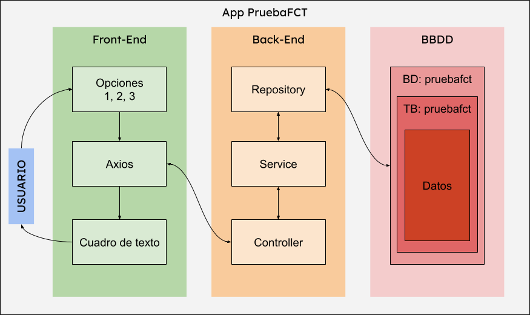

# Práctica 6 Ejemplo de entorno de despliegue para el proyecto de FCT del alumno Hugo Moruno Parra 

**URL**  

https://nginx.pruebafcthugocastelar.duckdns.org/

**API**

https://tomcat.pruebafcthugocastelar.duckdns.org/prueba-app/datos/1

## Índice

- [Práctica 6 Ejemplo de entorno de despliegue para el proyecto de FCT del alumno Hugo Moruno Parra](#práctica-6-ejemplo-de-entorno-de-despliegue-para-el-proyecto-de-fct-del-alumno-hugo-moruno-parra)
  - [Índice](#índice)
  - [Requisitos](#requisitos)
- [Base del Ejercicio](#base-del-ejercicio)
  - [Creación de la Máquina virtual](#creación-de-la-máquina-virtual)
  - [Obtención de subdominio DuckDNS](#obtención-de-subdominio-duckdns)
  - [Instalación de Docker](#instalación-de-docker)
    - [Creación de las redes de los contenedores](#creación-de-las-redes-de-los-contenedores)
  - [Contenedor de duckdns](#contenedor-de-duckdns)
  - [Contenedor de caddy](#contenedor-de-caddy)
  - [Contenedor de uptime-kuma](#contenedor-de-uptime-kuma)
- [Aplicaciones](#aplicaciones)
  - [Instalación del contenedor de Tomcat](#instalación-del-contenedor-de-tomcat)
    - [Creación de la aplicación de Spring](#creación-de-la-aplicación-de-spring)
    - [Despliegue de la aplicación de Spring](#despliegue-de-la-aplicación-de-spring)
  - [Instalación del contenedor de Nginx](#instalación-del-contenedor-de-nginx)
    - [Creación de la aplicación de React](#creación-de-la-aplicación-de-react)
    - [Despliegue de la aplicación de React](#despliegue-de-la-aplicación-de-react)
  - [Instalación del contenedor de MySQL](#instalación-del-contenedor-de-mysql)
    - [Estructura de la Base de Datos](#estructura-de-la-base-de-datos)
- [Explicación final y diagrama](#explicación-final-y-diagrama)

## Requisitos

- [x] Creación de la máquina VPS. 
  - [x] Configuración de la VPS.
    - [x] Obtener el subdominio de DuckDNS.
    - [x] Instalar Docker.
    - [x] Configurar el contenedor de DuckDNS.
    - [x] Instalar contenedor de Caddy (Proxy).
    - [x] Instalar contenedor de Kuma (Monitor).
- [x] Instalación del contenedor de Tomcat.
  - [x] Aplicación.
- [x] Instalación del contenedor de Nginx.
  - [x] Aplicación.
- [x] Instalación del contenedor de MySQL.
  - [x] Estructura.
- [x] Explicación y diagrama.

# Base del Ejercicio

[-> índice](#índice)

Sobre una máquina virtual de Azure, voy a crear el siguiente sistema:

- VPS:
  - Docker:
    - DuckDNS.
    - Caddy.
    - Kuma.
    - Nginx.
    - Tomcat.
    - MySQL.

Para ello, necesito:

- Conexión permanente a internet.
- Una máquina cualquiera (windows, unix o macintosh; en mi caso windows).
- Un servidor virtual (VPS, en mi caso Azure).
- Dominio de DuckDNS

## Creación de la Máquina virtual

[-> índice](#índice)

Para comenzar a usar la máquina virtual, debemos crearla en la página de portal.azure.com.
Buscaremos servicios gratuitos.
Seleccionaremos Máquina virtual con Linux.
Y cumplimentaremos el formulario con el siguiente contenido:

- Subscripción: Azure for Students
- Grupo de recursos: (Nuevo) ut6-pruebaFCT
- Nombre de máquina virtual: pruebaFCT
- Región: (yo voy a elegir (Europe) France Central, pero cualquiera en Europa sirve) (Europe) France Central.
- Imagen: Ubuntu Server 22.04 LTS - x64 gen. 2
- Tamaño: Standard_B1s - 1 vcpu, 1 GiB de memoria (8,61 US$/mes) (servicios gratuitos elegibles)
- Tipo de autenticación: Clave pública SSH
- Nombre de usuario: hugomoruno
- Origen de clave pública SSH: Usar la clave pública existente
- Clave pública SSH: contenido de la clave pública que creo a continuación:
  
**Crear un par de clave pública-privada**

<details>

    Para crear el par de llaves, primero abriremos una terminal de powershell e introduciremos:
    ```powershell
    ssh-keygen -t ed25519
    ```

    Una vez introducido, nos saldrá una salida parecida a la siguiente:
    ```powershell
    PS C:\Users\daw2> ssh-keygen -t ed25519
    Generating public/private ed25519 key pair.
    Enter file in which to save the key (C:\Users\daw2/.ssh/id_ed25519):
    Enter passphrase (empty for no passphrase):
    Enter same passphrase again:
    Your identification has been saved in id_ed25519
    Your public key has been saved in id_ed25519.pub
    The key fingerprint is:
    SHA256:Xm3dt07430AbA0GimYxmMSjGOb9CFIKzsnCDI3TWPeM daw2@DESKTOP-F1HNNF0
    The key's randomart image is:
    +--[ED25519 256]--+
    |o..o..+   ..o    |
    |ooBo.. O + . .   |
    |.*o+  = B   .    |
    |B + .o E   . o . |
    |+= . .  S . o = o|
    |. . .  . . . ..+o|
    |   .    .    .oo |
    |              +..|
    |               o+|
    +----[SHA256]-----+
    PS C:\Users\daw2>
    ```

    Ahora, muevo las claves a la carpeta .ssh. 
    ```powerhsell
    mv ~/id_ed25519 ~/.ssh/id_ed25519
    mv ~/id_ed25519.pub ~/.ssh/id_ed25519.pub
    ```

    Entonces la carpeta .ssh ya tendrá las claves nuevas:
    ```powershell
    PS C:\Users\daw2> dir ~/.ssh


        Directorio: C:\Users\daw2\.ssh


    Mode                 LastWriteTime         Length Name
    ----                 -------------         ------ ----
    -a----        28/10/2024     20:03            464 examenkey
    -a----        28/10/2024     20:03            103 examenkey.pub
    -a----        28/10/2024     17:48           1859 known_hosts
    -a----        28/10/2024     17:48           1115 known_hosts.old
    -a----        17/10/2024     16:11            464 pubauzrekey
    -a----        17/10/2024     16:11            103 pubauzrekey.pub
    -a----        17/10/2024     16:11            464 id_ed25519
    -a----        17/10/2024     16:11            103 id_ed25519.pub


    PS C:\Users\daw2>
    ```

</details>

- Puertos de entrada públicos: Permitir los puertos seleccionados
- Seleccionar puertos de entrada: HTTP (80), HTTPS (443), SSH (22)

Una vez rellenado el formulario completo, pulsas en Revisar y Crear.
Y después en Crear.

## Obtención de subdominio DuckDNS

[-> índice](#índice)

Una vez creada la máquina virtual, ahora me voy a la página de DuckDNS.org, inicio sesión y 
configuro mi dominio hugocastelar.duckdns.org en la ip pública de la máquina: 
52.143.181.228

Una vez creado, nos aparecerá un mensaje de success como el siguiente:

success: domain pruebafcthugocastelar.duckdns.org added to your account

Y ahora actualizamos la IP con la IP Pública de la máquina, nos aparecerá el siguiente mensaje:

success: ip address for pruebafcthugocastelar.duckdns.org updated to 52.143.181.228

## Instalación de Docker

[-> Índice](#índice)

Ahora, para poder iniciar los trabajos en la máquina virtual, debemos ejecutar el siguiente comando:
```powershell
ssh hugomoruno@hugocastelar.duckdns.org
```
 
<details>

    PS C:\Users\hugom\.ssh> ssh hugomoruno@pruebafcthugocastelar.duckdns.org
    Enter passphrase for key 'C:\Users\hugom/.ssh/id_ed25519':
    Welcome to Ubuntu 22.04.5 LTS (GNU/Linux 6.5.0-1025-azure x86_64)

    * Documentation:  https://help.ubuntu.com
    * Management:     https://landscape.canonical.com
    * Support:        https://ubuntu.com/pro

    System information as of Fri Oct 25 23:20:16 UTC 2024

    System load:  0.13              Processes:             101
    Usage of /:   2.4% of 61.84GB   Users logged in:       0
    Memory usage: 31%               IPv4 address for eth0: 10.1.1.4
    Swap usage:   0%

    Expanded Security Maintenance for Applications is not enabled.

    0 updates can be applied immediately.

    Enable ESM Apps to receive additional future security updates.
    See https://ubuntu.com/esm or run: sudo pro status


    The list of available updates is more than a week old.
    To check for new updates run: sudo apt update


    The programs included with the Ubuntu system are free software;
    the exact distribution terms for each program are described in the
    individual files in /usr/share/doc/*/copyright.

    Ubuntu comes with ABSOLUTELY NO WARRANTY, to the extent permitted by
    applicable law.

    To run a command as administrator (user "root"), use "sudo <command>".
    See "man sudo_root" for details.

    hugomoruno@pruebaFCT:~$
</details>

Ahora, procedemos a la instalación. Para ello, ejecutaremos los siguientes comandos:

```bash
curl -fsSL https://get.docker.com -o get-docker.sh
```
Obtiene el script de instalación automática de Docker.

```bash
sudo sh get-docker.sh
```
Ejecuta el script de forma desatendida.

Pongo como ejemplo mi salida:
<details>

    hugomoruno@pruebaFCT:~$ curl -fsSL https://get.docker.com -o get-docker.sh
    hugomoruno@pruebaFCT:~$ sudo sh get-docker.sh
    # Executing docker install script, commit: 6d51e2cd8c04b38e1c2237820245f4fc262aca6c
    + sh -c apt-get -qq update >/dev/null
    + sh -c DEBIAN_FRONTEND=noninteractive apt-get -y -qq install ca-certificates curl >/dev/null
    + sh -c install -m 0755 -d /etc/apt/keyrings
    + sh -c curl -fsSL "https://download.docker.com/linux/ubuntu/gpg" -o /etc/apt/keyrings/docker.asc
    + sh -c chmod a+r /etc/apt/keyrings/docker.asc
    + sh -c echo "deb [arch=amd64 signed-by=/etc/apt/keyrings/docker.asc] https://download.docker.com/linux/ubuntu jammy stable" > /etc/apt/sources.list.d/docker.list
    + sh -c apt-get -qq update >/dev/null
    + sh -c DEBIAN_FRONTEND=noninteractive apt-get -y -qq install docker-ce docker-ce-cli containerd.io docker compose-plugin docker-ce-rootless-extras docker-buildx-plugin >/dev/null
    + sh -c docker version
    Client: Docker Engine - Community
    Version:           27.3.1
    API version:       1.47
    Go version:        go1.22.7
    Git commit:        ce12230
    Built:             Fri Sep 20 11:41:00 2024
    OS/Arch:           linux/amd64
    Context:           default

    Server: Docker Engine - Community
    Engine:
    Version:          27.3.1
    API version:      1.47 (minimum version 1.24)
    Go version:       go1.22.7
    Git commit:       41ca978
    Built:            Fri Sep 20 11:41:00 2024
    OS/Arch:          linux/amd64
    Experimental:     false
    containerd:
    Version:          1.7.22
    GitCommit:        7f7fdf5fed64eb6a7caf99b3e12efcf9d60e311c
    runc:
    Version:          1.1.14
    GitCommit:        v1.1.14-0-g2c9f560
    docker-init:
    Version:          0.19.0
    GitCommit:        de40ad0

    ================================================================================

    To run Docker as a non-privileged user, consider setting up the
    Docker daemon in rootless mode for your user:

        dockerd-rootless-setuptool.sh install

    Visit https://docs.docker.com/go/rootless/ to learn about rootless mode.


    To run the Docker daemon as a fully privileged service, but granting non-root
    users access, refer to https://docs.docker.com/go/daemon-access/

    WARNING: Access to the remote API on a privileged Docker daemon is equivalent
            to root access on the host. Refer to the 'Docker daemon attack surface'
            documentation for details: https://docs.docker.com/go/attack-surface/

    ================================================================================

    hugomoruno@pruebaFCT:~$
</details>

¡Instalado! Ahora, hay que configurar nuestro usuario como usuario Docker, para ello:
```bash
sudo groupadd docker
sudo usermod -aG docker $USER
newgrp docker
```

Y si compruebo con el comando:
```bash
groups hugomoruno

#Ésta sería la salida
hugomoruno : hugomoruno adm dialout cdrom floppy sudo audio dip video plugdev netdev lxd **docker**
```

Como veo que ya está docker, está todo correcto.

### Creación de las redes de los contenedores

[-> Índice](#índice)

Para la estructura con el servicio de proxy, necesitaremos la red de docker: red_interna.
A su vez, como planteo la instalación de un servicio de monitorización, crearemos la red: red_monitor.

Los comandos serán los siguientes:

```bash
docker network create red_interna
docker network create red_monitor
```

## Contenedor de duckdns

[-> Índice](#índice)

Volvemos a la máquina virtual y en la carpeta que queramos (a poder ser en ~/ ), creamos una carpeta 
llamada duckdns.
```bash
mkdir duckdns
```
Dentro de la carpeta creamos el archivo docker-compose.yml.
```bash
touch ./duckdns/docker-compose.yml
```
Y dentro de la carpeta también creamos nuestro archivo .env.
```bash
touch ./duckdns/.env
```
Donde introduciremos el contenido en el siguiente formato:
```bash
SUBDOMAINS=pruebafcthugocastelar
TOKEN=4538f749-28b0-4b4e-8a73-xxxxxxxxxxxx
```

En el archivo de compose introducimos el contenedor de DuckDNS composerized.
El contenido del composer lo tenemos en el repositorio de Docker Hub del grupo linuxserver
en la siguiente dirección: [duckdns](https://hub.docker.com/r/linuxserver/duckdns)

[Compose de DuckDNS](./vms/duckdns/docker-compose.yml)

Ahora, nos situamos en la carpeta duckdns y ejecutamos el comando
```bash
docker compose up -d
```

Y la salida será la siguiente:
<details>

    hugomoruno@pruebaFCT:~/duckdns$ docker compose up -d
    [+] Running 9/9
    ✔ duckdns Pulled                                                                                 3.0s
      ✔ 68c4ea3779b6 Pull complete                                                                   0.7s
      ✔ df25a931801a Pull complete                                                                   0.9s
      ✔ ab0ddebe54a6 Pull complete                                                                   1.0s
      ✔ 19f39f464468 Pull complete                                                                   1.0s
      ✔ 7560e3e46aa2 Pull complete                                                                   1.5s
      ✔ 339ecd878087 Pull complete                                                                   1.6s
      ✔ fdaf29876bfe Pull complete                                                                   1.8s
      ✔ c606a5b2fbbd Pull complete                                                                   1.9s
    [+] Running 1/1
    ✔ Container duckdns  Started                                                                     0.2s
    hugomoruno@pruebaFCT:~/duckdns$
</details>

Comprobamos que se ha creado y levantado el contenedor con el comando:
```bash
docker ps

# Esta seria la salida.
hugomoruno@pruebaFCT:~/duckdns$ docker ps
CONTAINER ID   IMAGE                                COMMAND   CREATED              STATUS              PORTS     NAMES
400dc058f682   lscr.io/linuxserver/duckdns:latest   "/init"   About a minute ago   Up About a minute             duckdns
```

## Contenedor de caddy

[-> Índice](#índice)

Para empezar crearemos la estructura caddy en el mismo directorio donde se encuentra duckdns.
Es decir:
```bash
mkdir caddy
touch ./caddy/docker-compose.yml
```

E introduciremos el siguiente composer, del repositorio de [lucaslorentz](https://github.com/lucaslorentz/caddy-docker-proxy?tab=readme-ov-file#basic-usage-example-using-docker).

[Docker Compose](./vms/caddy/docker-compose.yml)

Ahora, una vez creado todo, nos situamos en la carpeta caddy. Y ejecutamos:
```bash
docker compose up -d
```

Si comprobamos el resultado con ```docker ps``` nos saldrá algo así:
```bash
hugomoruno@pruebaFCT:~/caddy$ docker ps
CONTAINER ID   IMAGE                                       COMMAND                  CREATED              STATUS              PORTS                                                                                NAMES
f3dc6fa9afd6   lucaslorentz/caddy-docker-proxy:ci-alpine   "/bin/caddy docker-p…"   About a minute ago   Up About a minute   0.0.0.0:80->80/tcp, :::80->80/tcp, 0.0.0.0:443->443/tcp, :::443->443/tcp, 2019/tcp   caddy
400dc058f682   lscr.io/linuxserver/duckdns:latest          "/init"                  31 minutes ago       Up 5 minutes                                                                                             duckdns
```

## Contenedor de uptime-kuma

[-> Índice](#índice)

Ahora para crear el sistema de monitorización empezaremos por crear la carpeta de uptimekuma:

```bash
mkdir ./kuma
touch ./kuma/docker-compose.yml
```

Ahora vamos a cumplimentar el docker compose con el siguiente archivo:

[docker-compose.yml](./vms/kuma/docker-compose.yml)

Y ahora, iniciamos el contenedor de kuma.

<details>

    hugomoruno@pruebaFCT:~/kuma$ docker compose up -d
    Creating volume "kuma_uptime-kuma-data" with default driver
    Pulling uptime-kuma (louislam/uptime-kuma:latest)...
    latest: Pulling from louislam/uptime-kuma
    b338562f40a7: Pull complete
    874bf4d93720: Pull complete
    b16337721583: Pull complete
    7d955db85b85: Pull complete
    2c706596bd17: Pull complete
    88a5c59ed14f: Pull complete
    5a1d0a896c33: Pull complete
    e68c2f25b946: Pull complete
    2e6c90f010d6: Pull complete
    ff15b10fabb8: Pull complete
    4f4fb700ef54: Pull complete
    2bb0dd8bbb19: Pull complete
    Digest: sha256:d8b1b2151256bda3a99e822902fcbeb27b3eca6ef6d93fad25d2062b9fb61ad2
    Status: Downloaded newer image for louislam/uptime-kuma:latest
    Creating uptime-kuma ... done
    hugomoruno@pruebaFCT:~/kuma$
</details>

Ahora, iniciamos una conexión privada por túnel ssh, en mi caso es el siguiente comando:
```powershell
ssh -ND 2110 hugomoruno@pruebafcthugocastelar.duckdns.org -i ~/.ssh/pubauzrekey

# -N Para no utilizar la conexión manualmente, -D Para el tunel directo, 
# 2110 puerto de mí maquina que voy a usar para la conexión.
```

Una vez iniciada la conexión, vamos a un navegador que pueda configurar el proxy y ponemos:
Proxy: localhost : 2110
Protocolo: SOCKs V.5.

Ahora buscamos la ip privada de la máquina virtual que en mi caso es: 10.1.1.4 y accedemos desde
el navegador configurado en la ruta http://10.1.1.4:3001/.

Ahí podremos monitorear el entorno creado desde dentro de la red_monitor.

# Aplicaciones

## Instalación del contenedor de Tomcat

[-> Índice](#índice)

Para crear el contenedor de Tomcat, tenemos dos posibles maneras, hacerlo por Docker Hub o hacerlo con un docker compose y subir los archivos por un túnel seguro. En mi caso, voy a elegir la imagen de Tomcat 11.0.0. Esto se debe a que, según la [documentación oficial](https://tomcat.apache.org/whichversion.html), la versión 11 de tomcat, cuya última versión a dia de 03/03/'25 es 11.0.0 soporta versiones superiores a Java 17 (inclusive).

Para este ejercicio, y en coherencia con lo anterior, elegiré el contenedor de tomcat:11.0.0 de la imagen oficial de [Tomcat](https://hub.docker.com/_/tomcat). 

### Creación de la aplicación de Spring

Para la creación de la aplicación de Spring he utilizado la página web [Spring Initializr](https://start.spring.io/). 
Esto se debe a que mi selección de IDE para el proyecto es IntelliJ IDEA Community Edition. 
Para comenzar la aplicación, seleccioné la versión 3.4.3 de SpringBoot, en java y con el gestor de maven.
Seleccionando el formato War para el despliegue y la versión 21 de java, debido a que es la última disponible con LTS.
Agregé las dependencias de Servidor Web, de Tomcat, de JPA, de MySQL y de autotest para Spring.

El código de la aplicación se estructura de la siguiente manera: 

  - Repositorio -> Accede a MySQL a través de Hibernate usando JPA.
  - Servicio -> Obtiene los datos del Repositorio y los transforma en grupos o selecciones.
  - Controller -> Se encarga de recibir, manejar y devolver los datos correspondientes de las peticiones.
  - Modelos -> Objeto que interpreta JPA para el manejo de la base de datos.

Puedes encontrar el código de la aplicación en el siguiente [enlace](./apps/spring/)

Por consiguiente generé el WAR usando maven, para desplegarlo en el servidor de Tomcat.

### Despliegue de la aplicación de Spring

[-> Índice](#índice)

Para el archivo de compose, es decir, con una instalación semi-manual a través de ssh. Éste mismo tendrá las siguientes líneas:

  - image: tomcat:11.0.0 / Imagen de tomcat descrita arriba.
  - volumes: ./webapps:/usr/local/tomcat/webapps / Para añadir el volumen dentro de la carpeta de páginas.
  - restart: always / Para evitar la caida del servicio sin reestablecimiento automático.

A la hora de copiar el docker-compose.yml se puede hacer manualmente a través de la terminal ssh. A la vez, crearemos una carpeta de nombre tomcat con la carpeta webapps dentro. 

Para subir el archivo a la aplicación, usaremos el paquete de rsync a traves de wsl.

1. Instalaremos el paquete rsync tanto en wsl como en la máquina.
   1. Ejecutar los comandos para la instalación:
      - ```sudo apt update```
      - ```sudo apt install rsync```
   2. Comprobar que está instalado:
      - ```rsync -V```
2. Nos situamos en cualquier carpeta en la terminal local y buscamos la ruta del archivo .war.
   - Una vez conseguido, E:\DEAPW-Hugo-Moruno\ut3\jakartaEE\JakartaDespliegue\JakartaDespliegue-1.0-SNAPSHOT.war, buscamos esa url dentro de WSL y la usamos para el comando rsync.
   - Lo subiremos al servidor con el siguiente comando:
     - ```rsync -a -e "ssh -i ~/.ssh/pubauzrekey" ./prueba-app.war hugomoruno@pruebafcthugocastelar.duckdns.org:/home/hugomoruno/tomcat/webapps```
   - Este comando se ejecuta en wsl de la máquina local.
3. Una vez subido, compruebo que se ha subido con el comando:
   - ```ls ~/tomcat/webapps```
   - Y nos devuelte:
   - ```bash 
     hugomoruno@pruebaFCT:~$ ls ~/tomcat/webapps
     prueba-app.war
     ```

## Instalación del contenedor de Nginx

### Creación de la aplicación de React

[-> Índice](#índice)

Para la creación de la aplicación se ha necesitado de la instalación de node, la versión resulta indiferente siempre que sea superior a la 20. 
La aplicación se ha creado con la librería create-react-app, aunque esta misma ya queda en desuso a mediados de este 2025. No por ello resulta insegura.
  
Una vez generada la aplicación de ejemplo, se ha desarrollado una página web sencilla en la que se muestran 3 botones 
y dependiendo de cuál se llame, se realiza una petición u otra a la API. 
Para las peticiones se ha usado la librería de Axios embebida en los Hooks de React. 

Puedes encontrar la aplicación en el siguiente [directorio](./apps/react/)

Para el despliegue de la misma, se genera un comprimido en la carpeta [build](./apps/react/build/) que contiene únicamente un archivo html, 
un css y un js. Lo cual permite un despliegue muy sencillo y sin tener que intermediar con comandos o plataformas específicas para su ejecución.

### Despliegue de la aplicación de React

[-> Índice](#índice)

Para el despliegue de la aplicación continuaremos los siguientes pasos:

  - Creación de la carpeta: ``` mkdir ~/nginx ~/nginx/html ```
  - Creación del archivo de Docker Compose: ``` touch ~/nginx/docker-compose.yml ```
  - Introducimos el contenido del [compose](./vms/nginx/docker-compose.yml).
  - Ejecutamos ``` docker compose up -d ``` en la carpeta.
  - Subimos el contenido de la [carpeta](./vms/nginx/html/) a la recién creada carpeta html usando la librería rsync de la siguiente manera:
    - ``` rsync -a -e "ssh -i ~/.ssh/pubauzrekey" . hugomoruno@pruebafcthugocastelar.duckdns.org:/home/hugomoruno/nginx/html ``` (situados en la carpeta donde tengamos la app).
  - Comprobamos que la ejecución sea correcta visitando la url: [nginx.pruebafcthugocastelar.duckdns.org](https://nginx.pruebafcthugocastelar.duckdns.org/)

## Instalación del contenedor de MySQL

[-> Índice](#índice)

Para la creación del contenedor continuaremos los siguientes pasos:

  - Creación de la carpeta: ``` mkdir ~/mysql ```
  - Creación del archivo de Docker Compose: ``` touch ~/mysql/docker-compose.yml ```
  - Introducimos el contenido del [compose](./vms/mysql/docker-compose.yml).
  - Ejecutamos ``` docker compose up -d ``` en la carpeta.

Ahora, utilizando el compose proporcionado, tendremos un contenedor de mysql escuchando en el puerto 3306 con contraseña de root: pruebafct.

### Estructura de la Base de Datos

La estructura de la base de datos es muy sencilla. Ya que se trata de un ensayo de despliegue para el TFC real, he usado la mínima expresión de una base de datos:
   - Base de datos: pruebafct
     - Tabla: pruebafct
       - Entidad: 
         - id: numeric
         - message: varchar

De ahí, la app de Spring recoge el valor textual a través del ID y lo devuelve para que el front-end en React pueda mostrarlo al cliente.

# Explicación final y diagrama

[-> Índice](#índice)

La estructura de la aplicación se compone de 3 componentes esenciales. 

1. Front-End
2. Back-End
3. Persistencia de Datos - Base de Datos

Estos se desarrollan en las Tecnologías de:

1. React.js - Desarrollado por Facebook.
2. Spring Boot - Desarrollado por VMware.
3. MySQL - Desarrollado por Sun Microsistems.

Todas las tecnologías son de código abierto y los IDEs usados también, los cuales son:

1. Front -> VSCode.
2. Back -> InteliJ IDEA Community Edition.
3. BBDD -> VSCode (a través del plugin SQLTools, desarrollado por Matheus Texeira).

El dibujo de cómo se mueve la información es el siguiente:


